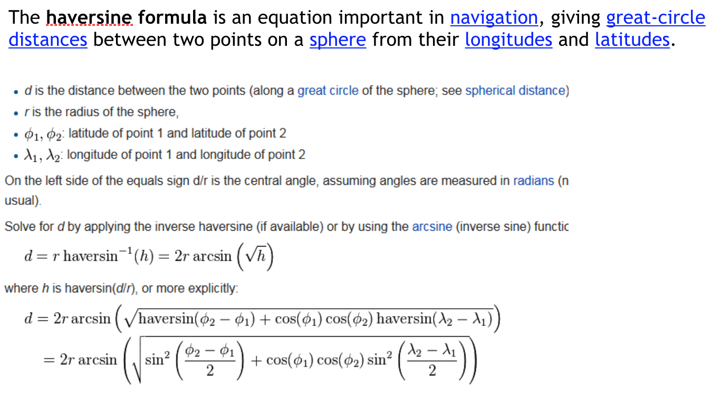
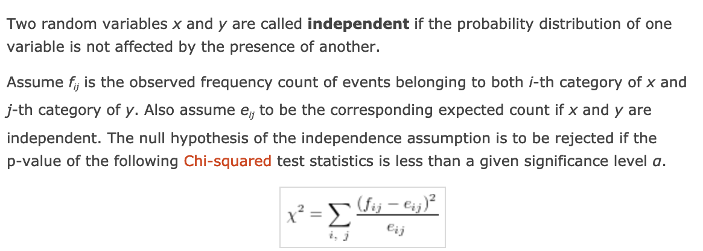
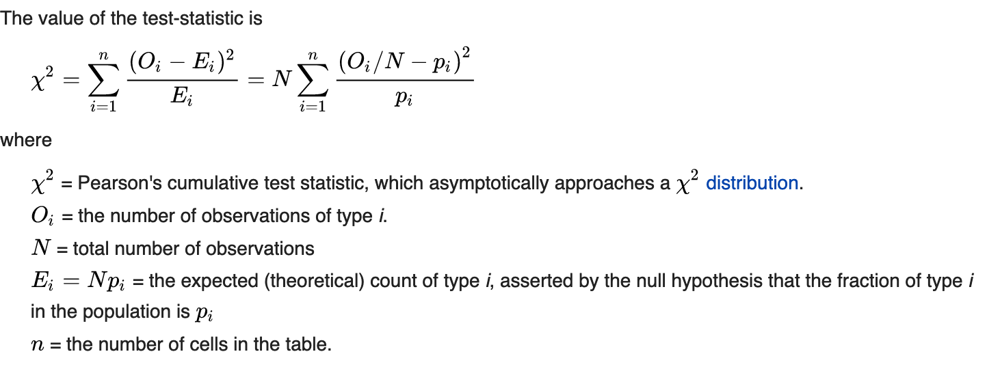

# Duomenu gavybos pagrindai

## 1. Fundamentals of T-Test Using R

- **Kaip patikrinti ar yra skirtumas tarp dviejų duomenų grupių.**
- Skaityti antros paskaitos medžiagą. Atsakant reikia sugebėti pateikti sprendimą
  1. Naudojant SQL kalbą (atsakymo metu turi būti pateikti konkretūs SQL sakinių pavyzdžiai)
  1. Paaiškinti sprendimą naudojant matematinės statistikos metodus.

---

- Atsakymo metu turi būti pateikti **konkretūs SQL sakinių pavydžiai**.

```sql
SELECT AVG(totalprice),COUNT(1),state FROM orders o
WHERE o.state IN ('CA', 'NY')
GROUP BY state
```

- t-test is used when you want to compare the means (averages) of two groups in situations where you only have samples of the two groups under investigation
- The t-test calculates the mean score of each of the two samples and compares the two sample means to infer if the two means of the parent populations (all male students and all female students) are probably the same or not. 
- Pagrindinis - **Welch's t-test**, or unequal variances t-test, is a two-sample location test which is used to test the hypothesis that two populations have equal means
- **Shapiro-Wilk test** nustato skirstinio normaluma (**Gauso** pasiskirstyma)
- Normalumas taip pat gali buti nustatomas pagal histogramos forma
- In a **paired sample t-test**, each subject or entity is measured twice, resulting in pairs of observations.

```r
# Nuskaitomi duomenys
d <- read.table("2lab.rdata", header=T, sep=",")

# Vidurkiai
mean(d$MC)
mean(d$VI)

# T-Test
t1 <- t.test(d$MC, d$VI)
t1

# Shapiro-Wilk normalumo testas
shapiro.test(d$MC)
shapiro.test(d$VI)

# Histogramos
hist(d$MC, xlim=c(0,100), breaks=500) 
hist(d$VI, xlim=c(0,100), breaks=500) 

# Kvantiliu grafikas
dev.new()
qqnorm(d$MC)
qqline(d$VI)
```

## 2. Geografinių duomenų naudojimas

- Atsakymo metu turi būti pateikti **konkretūs SQL sakinių pavydžiai**.

```sql
SELECT zipcode, longitude,
(CASE WHEN hhuofuelsolar = 0 THEN latitude END) as nosolarlat,
(CASE WHEN hhuofuelsolar > 0 THEN latitude END) as solarlat
FROM zipcensus
WHERE latitude BETWEEN 20 and 50 AND
longitude BETWEEN -135 AND -65
```



## 3. Chi-Square pasiskirstymas ir jo panaudojimas

- Chi-Square testas naudojamas siekiant nustatyti, ar yra reikšmingas skirtumas tarp stebimų dažnių vienoje ar daugiau kategorijų.



- Chi-square test is a **family** of statistical tests that uses the chi-square distribution for statistical testing. That **includes Pearson's** chi-square testing.
- Pearson's test is simply the **most common chi-square test**.



## 4. Laiko eilučių analizė naudojant SQL

- Laiko eilutė (**time series**) yra duomenų taškų, indeksuotų laiko eilutėje, serija.
- Dažniausiai laiko eilutė yra seka, paimta iš eilės **tolygiai** išdėstytų laiko segmentų.
- Laiko eilučių analizė (**Time series analysis**) apima laiko eilučių duomenų analizės metodus, siekiant gauti prasmingą statistiką ir kitas duomenų savybes.
- Laiko eilučių prognozavimas (**Time series forecasting**) yra modelio (pvz. koncepcinis modelis) naudojimas, kad būtų galima prognozuoti būsimas vertes pagal anksčiau pastebėtas vertes.
- Nors regresinė analizė dažnai naudojama taip, kad būtų galima išbandyti teorijas, kad vienos ar daugiau nepriklausomų laiko eilučių dabartinės vertės **turi įtakos** kitos laiko eilutės dabartinei vertei, šis laiko eilučių analizės tipas **nėra vadinamas** laiko eilutės analize, kuri orientuota į vienos laiko eilutės arba daugkartinio priklausomybės laiko eilučių palyginimą **skirtingais laiko momentais**.
- Pertraukta laiko eilučių analizė (**Interupted time series analysis**) - tai vienos laiko eilutės intervencijų analizė.


## 5. Laiko eilučių analizės matematiniai modeliai

```r
# Number of births per month in New York city, from January 1946 to December 1959 
# Seasonal data

births <- scan("http://robjhyndman.com/tsdldata/data/nybirths.dat")
birthstimeseries <- ts(births, frequency=12, start=c(1946,1))
birthstimeseries
plot.ts(birthstimeseries)

# Decompose (estimate) seasonal data

birthstimeseriescomponents <- decompose(birthstimeseries)
birthstimeseriescomponents$seasonal
birthstimeseriescomponents$trend
birthstimeseriescomponents$random
plot(birthstimeseriescomponents)

# Adjust seasonal data 

birthstimeseriescomponents <- decompose(birthstimeseries)
birthstimeseriesseasonallyadjusted <- birthstimeseries - birthstimeseriescomponents$seasonal
plot(birthstimeseriesseasonallyadjusted)
```

- Laiko tendencijos (**Trend**) modeliai leidžia manyti, kad laikui bėgant yra tam tikras nuolatinis deterministinis pattern’as. Šie modeliai geriausiai tinka duomenims, kuriuose dominuoja atsitiktiniai svyravimai
  - **Sezoninis** (Seasonality) - pagal metus ar pagal sezonus ir tt..
  - **Moving average** - Laiko eilučių analizėje judantis vidutinis (Moving Average) modelis (MA modelis), dar vadinamas judančiuoju vidurkiu, yra bendras metodas vienfaktorių laiko eilučių modeliavimui. Judantis vidutinis modelis nurodo, kad išvesties kintamasis **tiesiškai priklauso nuo** dabartinių ir įvairių praeities stochastinio (netobuliai nuspėjamo) **laikotarpio reikšmių**.
  - **Auto Regressive Model** - Statistikoje, ekonometrijoje ir signalų apdorojime autoregresinis (AR) modelis yra atsitiktinio proceso tipo atvaizdavimas. Jis naudojamas apibūdinti tam tikrus procesus gamtoje, ekonomikoje ir pan. Autoregresinis modelis nurodo, kad išvesties kintamasis **tiesiškai priklauso nuo savo ankstesnių verčių** ir stochastinio termino (netinkamai nuspėjamas terminas); todėl modelis yra stochastinio skirtumo lygtis. Mašininio mokymosi metu autoregresyvus modelis mokosi iš laiko nustatytų žingsnių ir ima matavimus iš ankstesnių veiksmų kaip regresijos modelio įvestį kad būtų galima prognozuoti kito laiko žingsnio vertę

## 6. Išgyvenamumo analizė (Survival analysis) naudojant SQL

- **Tenure** – laikotarpis kurį klientas aktyvus (dienomis)
- **Popt** – Kiek klientų su tokiu laikotarpiu
- **Stopt** – Kiek klientų su tokiu laikotarpiu nutraukė kontraktą

## 7. Išgyvenamumo analizė naudojant matematinės statistikos metodus

- **Survival analysis** is a branch of statistics for analyzing the **expected duration** of time until one or more events happen, such as death in biological organisms and failure in mechanical systems.
- Survival analysis attempts to answer questions such as:
  - what is the proportion of a population which will **survive** past a certain time?
  - Of those that survive, **at what rate** will they die or fail?
  - Can **multiple causes** of death or failure be taken into account?
  - How do particular **circumstances** or characteristics **increase** or decrease the **probability** of survival?
- The object of primary interest is the **survival function**, conventionally denoted **S**, which is defined as **S(t) = Pr(T > t)** where t is some time, T is a random variable denoting the time of death, and "Pr" stands for probability.
- The hazard function, conventionally denoted λ = f(t) / S(t), is defined as the event rate at time t conditional on survival until time t or later (that is, T ≥ t) - hazard, is the **probability** that someone **succumbs** to a risk at a given point in time.

## 8. Asociacijos taisyklės ir Apriori Algoritmas

- **Asociacijos taisyklės** veikia pagrindu  **if/then** statements. Šie teiginiai padeda atskleisti asociacijas,  tarp **nepriklausomu** duomenų reliacinėje duomenų bazėje ar kitose informacijos saugyklose. Šios taisyklės naudojamos identifikuoti santykius tarp daiktų, kurie **paprastai naudojami kartu**.
- Yra įvairių algoritmų, kurie naudojami asociacijos taisyklių mokymuisi įgyvendinti - vienas iš jų - **Apriori**
- Pirmojo **Apriori algoritmo** žingsnio metu nustatomi **dažni** vieno elemento **rinkiniai**. Vykdant šį algoritmo žingsnį, pereinama visa duomenų rinkmena ir nustatoma, kiek kartų kiekvienas elementas sutinkamas rinkmenoje, ir tolimesniam apdorojimui naudojami tik tie elementai, kurie tenkina nustatytą minimalų pasirodymų dažnį
- Kiti algoritmo žingsniai susideda iš dviejų dalių: **Potencialiai dažnų** elementų rinkinių **generavimo** (jie vadinami kandidatais) ir rinkinių kandidatų **dažnumo nustatymo**. Apriori algoritmas generuoja kito žingsnio elementų rinkinius kandidatus tik **iš rastų** dažnų rinkinių prieš tai atliktame žingsnyje. Pagrindinė intuicija yra ta, kad **bet kuris dažnas** elementų rinkinio **poaibis** turi būti dažnas rinkinys. Todėl rinkiniai kandidatai, sudaryti k elementų, generuojami sujungiant dažnus elementų rinkinius, turinčius k–1 elementų, kurie tenkina minimalų pasikartojimų skaičių


## 9. Dirbtinis neuroninis tinklas


