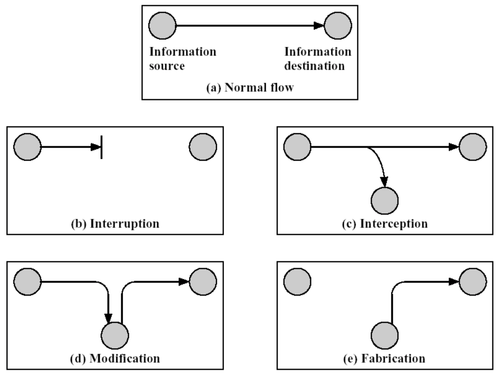

# Informacines Saugos Pagrindai

## Įvadas – pagrindinės sąvokos ir problematika

- **Informacijos sauga** - mokslas apie informacijos konfidencialumą, vientisumą ir prieinamumą.
- **CIA** Triada (Confidentiality, Integrity, Availability):
  - Konfidencialumas (**Confidentiality**) - informaciją gali gauti tik tas, kam ji yra siunčiama.
  - Vientisumas (**Integrity**) - niekas negali pakeisti dalies arba visos žinutės turinio.
  - Prieinamumas (**Availability**) - visada prieinama tam, kas ją turi gauti
- Autentiškumas (Authentication) - gavėjas turi būti tikras  nuo ko gavo žinutę. Niekas kitas negali apsimesti siuntėju.
- Negalėjimas atsisakyti (Nonrepudiation) - siuntėjas ir gavėjas vėliau negali paneigti kad jie siuntė ir gavo būtent šią žinutę.
- Prieinamumo kontrolė (Access control) - informacijos šaltinis yra pilnai kontroliuojamas kam tai priklauso.

---

- **Vertybė** - tai išteklius, kuris, veikiant priešiškiems išoriniams veiksniams, prarastas.
  - **Informacinis turtas**: duomenų bazės ir duomenų rinkmenos, dokumentai, vadovai, naudojimo ir palaikymo procedūros, planai, archyviniai duomenys.
  - **Popieriniai dokumentai**: sutartys, rekomendacijos, bendrovės dokumentai, kiti dokumentai.
  - **Programinė įranga**: taikomoji programinė įranga, sistemos programinė įranga, plėtros ir paslaugų priemonės.
  - **Fizinė įranga**: kompiuterinė įranga (sisteminiai blokai, monitoriai), ryšių įranga (maršrutizatoriai, komutatoriai, fakso aparatai), duomenų laikmenos (juostos, diskai), kita įranga (maitinimo šaltiniai, oro kondicionieriai), bal-dai, patalpos.
  - **Žmonės**: darbuotojai, klientai, abonentai.
  - **Įvaizdis**.
  - **Paslaugos**: skaičiavimo ir ryšio paslaugos, komunalinės paslaugos.
- **Grėsmė** - tai scenarijus arba **veiksmų seka**, kuri pasinaudoja informacinės sistemos pažeidžiamumu ir gali sukelti žalą vienai ar kelioms sistemos vertybėms.
- **Pažeidžiamumas** - tai vieno ar kelių sistemos elementų **silpnybė**, kuria pasinaudojus gali būti pažeistas normalus sistemos funkcionalumas.
- **Rizika** – tai tam tikra tvarka **apskaičiuota skaitinė vertė**, nusakanti, kokių pasekmių turės grėsmės realizacija.

---

- Informacinės saugos **principai**:
  - **Mažiausių privilegijų** – bet kuris su sistema susijęs objektas (vartotojas, administratorius, programa, sistema) privalo turėti ne platesnes privilegijas nei tos, kurių reikia atlikti visiems objektui priskirtiems uždaviniams. 
  - **„Gilios“ apsaugos** – negalima pasikliauti priklausomybe nuo vienintelio saugumo mechanizmo, kad ir koks nepažeidžiamas jis atrodytų. Būtinas saugumo sistemų dubliavimas. 
  - **Saugumo požiūrių**
    1. Leista tik tai, kas yra oficialiai leista
    2. Leista viskas, kas nėra oficialiai uždrausta)
  - **Paprastumo** – išvengiama konfigūravimo klaidų, rekomendacijų vykdymo vengimo, neaiškumų. 
  - **Saugumo per neaiškumą** – esmė yra neįprasta konfigūracija, arba ta, kurią sunku suprasti. Tai gali būti nestandartinių prieigų parinkimas teikiamiems servisams, netradicinė duomenų ar konfigūracinių failų lokalizacija.

### Atakų prieš informacijos saugą rūšys

- **Pasyvios** atakos - nekeičia informacijos srauto
  - Informacijos **nutekėjimas**
  - Informacijos **srauto analizė** (traffic analysis)
- **Aktyvios** atakos - keičiama informacija sraute
  - **Apsimetimas** (masquerade)
  - Informacijos **užlaikymas** (replay)
  - Informacijos turinio **pakeitimas** (modification)
  - Paslaugų **blokavimas** (denial of service)

---

- Informacinės saugos problemų sprendimas:
  - **Techniniai** sprendimai
    - Šifravimas
    - Tinklų konfigūracija
    - Antivirusai, IDS
  - **Organizaciniai** sprendimai
    - Saugumo politika
    - Standatai, auditas
  - **Rizikos valdymas**
    - Fizinė apsauga ir personalo kontrolė
    - Spynos, priešgaisrinė signalizacija, video stebėjimas

## Prieigos kontrolė

- **Prieigos kontrolė** – tai politika, programinis arba aparatinis komponentas, naudojamas priėjimo teisei išduoti arba suteikti prie tam tikro ištekliaus.
- Apima procesus AAA:
  - **Authentication** (I&A – Identification and Authentication) - vienareikšmiškai apibrėžti vartotoją ir patikrinti, ar iš tikrųjų žmogus (procesas/įrenginys), norintis identifikuotis sistemoje, yra tas, kuo save vadina. 
    - pagal **informaciją** – autentifikacijai pateikiama informacija, kurią teoriškai žino tik teisėtas vartotojas (pvz., slaptažodis, PIN ir t. t.).
    - pagal **tapatybės kodą** – autentifikacijai pateikiamas tapatybę įrodantis kodas, kuris priklauso tik vartotojui, jis pateikiamas tam tikroje laikmenoje arba formate, kurio neįmanoma arba sunku padirbti (tapatybės kortelė, RFID, sertifikatas ir t. t.).
    - pagal **vartotoją** – autentifikacijai pateikiama vartotojo dalis (pvz., skenuojamas piršto antspaudas, akių rainelė ir t. t.).
    - pagal **vietą** – tikrinama, ar bandoma jungtis iš leistinos vietos (pvz., iš vidinio tinklo).
  - **Authorization** - nustato, kokių teisių turi prie informacinės sistemos prisijungęs vartotojas arba esybė
  - **Audit** - įvykių, klaidų, prisijungimų, objektų naudojimo, autentifikacijos bandymų ir kitos susijusios informacijos stebėjimo bei fiksavimo procesas.
- **Prieigos kontrolės modeliai** aprašo teisių valdymo mechanizmą.
  - MAC (mandatory access control)
    - Prieigos valdymo modelis, nusakomas sistemos, bet ne objekto savininko, t.y. prieigos teisės negali būti pakeistos vartotojo arba savininko.
    - MAC modeliu pagristose sistemose visi objektai ir subjektai turi turėti priskirtas saugumo etiketes (label).
    - Subjektas, turintis tam tikrą pasitikėjimo lygį, gali prieiti prie pagal lygį lygių ar žemesnių saugumo kategorijos objektų.
  - DAC (discretionary access control)
    - tai prieigos valdymo modelis, kuriame prieigos teises apibrėžia objekto savininkas, t. y. nusprendžia, kas ir kokiu lygiu gali prieiti prie objekto.
    - Kiekvienas objektas turi savininką.
    - Pirminis objekto savininkas – objekto kūrėjas.
    - Savininkas gali deleguoti savininko teises kitam subjektui.
    - Prieigos teises prie objekto nusako savininkas.
  - RBAC (role-based access control)
    - nauja alternatyva MAC ir DAC modeliams. Modelis pagrįstas vartotojų vaidmenų sukūrimu, kurie tiesiogiai išreiškia jų pareigas

---

- Technologiniai autentifikacijos sprendimai
  - Vartotojo vardas ir slaptažodis
  - Kerberos - "bilietais" grįstas bendravimos protokolas
  - CHAP (Challenge-Handshake Authentication Protocol)
  - Sertifikatai - electronic document used to prove the ownership of a public key.
  - SmartCard - Smart cards can be used as a security token
  - Biometrinė autentifikacija
  - Kelių faktorių autentifikacija

## Kenksmingas programinis kodas ir apsaugos metodai

- Kenksmingas programinis kodas (angl. **malware**) - tai programinė įranga, sukurta siekiant pakenkti kompiuterinei sistemai arba į ją įsiskverbti be teisėto sistemos vartotojo žinios. 
  - Infekcinis kenkėjiškas (kompiuterių virusai, kirminai), 
  - Nuotolinės prieigos užtikrinimo KPK (Trojos arkliai, rootkit, backdoor, botnet), 
  - Šnipinėjantis KPK (spyware, keylogger), 
  - Reklamos platinimo KPK (adware), tiesioginį pelną kuriantis KPK (dialer) 
  - Kitas (grandininiai laiškai, pokštai, loginės bombos, velykiniai kiaušiniai ir t. t.). 

---

- Klasifikacija pagal **infekavimo strategiją**:
  - Įkrovos – plintantys per įkrovos sektorius: 
    - Pagrindinio įkrovos sektoriaus (master boot record (MBR)) : Boot Strap Code pakeičiantys, MBR pakeičiantys, pagrindiniame įkrovos sektoriuje PT įrašus pakeičiantys, MBR perkeliantys. 
    - DOS įkrovos sektoriaus (DOS boot record (DBR)) virusai: standartinį infekavimą vykdantys virusai, ypatingą (extra) sektorių formatuojantys virusai, sektorius žymintys kaip BAD virusai.
  - Rinkmenas užkrečiantys:
    - rinkmeną perrašantys 
    - atsitiktine tvarka rinkmenas perrašantys 
    - rinkmeną pabaigoje papildantys, rinkmeną pradžioje papildantys
    - klasikiniai parazitiniai virusai 
    - tuštumas rinkmenoje užpildantys virusai 
    - rinkmenas suspaudžiantys virusai
    - Kiti…

---

- Klasifikacija **pagal elgesį** kompiuterio atmintyje:
  - Tiesioginio poveikio (direct action) ~
    - Yra įkraunami į kompiuterio atmintį kartu su užkrėsta programa.
    - Jie ieško naujų rinkmenų, kurias galėtų užkrėsti.
    - Paprasčiausias ~ tipas, kartais vadinami nerezidentiniais ~.
  - Rezidentinių ~ (memory resident) veikimo šablonas:
      1. Virusas gauna sistemos kontrolę
      2. Išskiria sau atminties bloką
      3. Perkelia savo vykdomąjį kodą į išskirtą atminties bloką
      4. Aktyvuoja save išskirtame atminties bloke
      5. Perima vykdomųjų rinkmenų vykdymo kontrolę
      6. Infekuoja naujas rinkmenas ir (arba) sistemines sritis.
  - Laikinieji rezidentiniai ~ (temporary memory resident) 
    - Lieka atmintyje tam tikrą laiką, kol neįvyksta koks nors numatytas įvykis
  - Sukeičiantys ~ (swapping) 
    - nuolat rašo mažas ~ kodo dalis tiesiai į atmintį. 
    - Dažniausiai įrašomi kodo gabaliukai – aktyvuojantys įvykiai, kurie iškviečia visą ~ kodą iš disko ir tokiu būdu infekuoja naują objektą.
  - ~, veikiantys vartotojo aplinkoje (user mode)
    - pasileidžia kaip proceso dalis. 
    - Virusui veikti reikalinga šiuolaikiška, daugelio užduočių operacinė sistema.
  - ~, veikiantys branduolio aplinkoje (kernel mode)
    - slepiasi kaip branduolio lygio tvarkyklė.
  - Įsiterpiantys į atmintį per tinklą
    - tai ~ (dažniausiai kirminai, pvz., CodeRed ir Slammer), kurie gali užkrėsti sistemą į ją atkeliavę kaip tinklo paketų rinkinys
    - diske jie dažniausiai neišsisaugo.

---

- Klasifikacija pagal **kodo evoliuciją**
  - Nekoduoti ~ – paprasčiausia ir seniausia ~ rūšis.
  - Koduoti ~ (encrypted)
    - ~, kurių funkcionalumas yra paslėptas, užkodavus ~ kūną kriptografiniu algoritmu. 
    - ~ prasideda deasembleriui atspariu dekodavimo moduliu, po kurio eina pagrindinius darbus atliekantis užkoduotas viruso kūnas. 
  - Oligomorfiniai ~ (oligomorphic)
    - koduoti ~, turintys kelis kodavimo arba dekodavimo variklius, sugebantys keisti juos vykstant evoliucijai. 
    - Kodavimo arba dekodavimo variklių skaičius gali svyruoti atsižvelgiant į ~, bet jis yra fiksuotas.
  - Polimorfiniai ~ (polymorphic) sugeba vykdyti beveik neribotas dekodavimo variklių mutacijas.
  - Metamorfiniai ~ (metamorphic)
    - savo kūnu polimorfiniai ~, t. y. jie neturi dekodavimo variklio arba pastovaus ~ kūno, bet sugeba kurti naujas generacijas, kurios atrodo vis kitaip. 
  - Surenkamų priemonių komplektai (kits) – įrankiai, skirti ~ kūrimui automatizuoti.

---

- Klasifikacija pagal **poveikį užkrėstai sistemai**
  - ~, tik replikavimosi funkciją (no-payload), dažniausiai kuriami bandymų tikslais.
  - Atsitiktinai kenkiantys (accidentally destructive payload)
    - ~, galintys pakenkti užkrėstai sistemai replikavimosi metu, nors kūrėjai tokio tikslo neturėjo.
    - Žala padaroma dėl loginių klaidų ~ kode.
  - Nekenkiančių, bet turinčių papildomų funkcijų (nondestructive payload) ~ kategorijai priklauso per 50 proc. visų ~. 
    - ~ funkcionalumas pasireiškia informacinio pranešimo demonstravimu  (pokštas, politinis ir t. t.).
  - Kenkiantys (destructive payload)
    - ~, sukeliantys neesminių nepatogumų užkrėstų sistemų vartotojams (apversti aukštyn kojomis operacinės sistemos paleidimo fonai, įterpti žodžiai dokumentuose).
  - Stipriai kenkiantys (highly destructive payload)
    - Stipriai pažeidžia programinę įr., saugomus duomenis ar aparatinę įr.
  - ~, skirti DDoS atakoms vykdyti, nekenkia užkrėstam kompiuteriui tiesiogiai.

### KPK tipai ir pavyzdžiai

- **Kompiuterinis virusas** – tai KPK, kuris gali rekursiškai replikuoti galimai evoliucionavusią savo kopiją. Virusai infekuoja arba rinkmenas, arba sistemines sritis, arba tiesiog modifikuoja nuorodas į tuos objektus, tokiu būdu perimdami jų kontrolę. Virusui paleisti reikalingas išorinis trigeris, pvz., vartotojo paleidimas. Viruso apibrėžimas nurodo tik plitimo būdą, bet ne jo atliekamus veiksmus.
- **Kirminai** – tai tinklinis KPK, plintantys kompiuteriniais tinklais. Kirminas pasileidžia automatiškai, be vartotojo įsikišimo. Kirminai – tai atskiras programinis paketas, nors dalis kirminų, pvz., W32/Nimda.A@mm, taip pat infekuoja ir rinkmenas, todėl kirminus galima vadinti virusų atmaina. Pagrindinė viruso priskyrimo kirminų kategorijai priežastis – orientavimas į tinklinį plitimą.
- **Mailer ir mass-mailer kirminai** - atskira kompiuterinių kirminų klasė, plinta e. paštu. Mass-mailer žymėti naudojamas „@mm“. Pavyzdžiui, VBS/Loveletter.A@mm siunčia daugybę e. laiškų ir įtraukia į kiekvieną savo kopiją. Mailer („@m“) siunčia savo kopijas rečiau, pvz., W32/SKA.A@m siunčia savo kopiją su kiekvienu vartotojo išsiųstu nauju laišku. 
- **Aštuonkojis (octupus)** – sudėtinga kompiuterinio kirmino rūšis, egzistuoja kaip atskirų programinių paketų rinkinys viename kompiuteryje arba tinkle. Šiuo metu tai nėra plačiai paplitusi.
- **Triušis (rabbit)** – kompiuterinio kirmino atmaina, kuri egzistuoja kaip vienintelė savo kopija visais laiko momentais, šokinėdama per prie tinklo prijungtus kompiuterius. Dalis tyrinėtojų apibrėžia rabbit terminu KPK, kuris veikia rekursiniu būdu siekdamas iki galo išnaudoti kompiuterio išteklius (RAM, CPU) ir sumažinti jo darbo našumą. 
- **Loginė bomba** – tai tam tikru tikslu legalioje aplikacijoje užprogramuota funkcija, kuri pasireiškia įvykus tam tikrai loginei operacijai, pvz., bandomoji versija išsitrina po tam tikro programos paleidimų skaičiaus. Funkcionalumą gali lemti ir legalūs programinės įrangos gamintojų tikslai (apsauga nuo piratavimo), ir neteisėtas programuotojų noras palikti programoje nesankcionuotą prieigą. 
- **Velykinis kiaušinis (Easter egg)**, t. y. nenumatytas juokingas veikimas, kuriam paleisti reikia tam tikrų žinių. Neigiamas poveikis sistemai – eikvojami kompiuterio ištekliai.
- **Trojos arklys** bando apsimesti naudinga programa ir priversti vartotoją ją paleisti. Kitais atvejais įsilaužėliai Trojos arklio funkcijas (sistemos kompromitavimą ir galimybę atlikti kenkėjiškus veiksmus vėliau) perkelia realiai naudojamai programinei įrangai, t. y. ją modifikuoja. Antrojo tipo Trojos arkliai yra sunkiau aptinkami, labiau paplitę atvirojo kodo OS, nes įsilaužėliai gali tiesiogiai modifikuoti pradinius tekstus. 
- **Šnipinėjimo programa (Spyware)** – tai terminas, kuriuo apibūdinama įvairaus tipo šnipinėjimo programinė ir aparatinė įranga.
- **Reklamos programa (Adware)** skirta reklamai automatiškai vaizduoti, keisti užkrėstame kompiuteryje ir naujoms reklamoms automatiškai atsisiųsti. Reklamos programos kūrėjai dažniausiai stengiasi apsisaugoti nuo persekiojimo pateikdami vartotojui licenciją. 
- **Rinkikliai (Dialer)** paplito telefoninio (dial-up) jungimosi prie interneto laikais. Jų esmė – sugundyti vartotoją paskambinti didelio tarifo telefono numeriu. Šiuo metu panašus sprendimas naudojamas web puslapiuose su WWW nuorodomis, kurios jungiasi prie mokamų paslaugų.
- **Išpirkos prašytojai (Ransomware)** – duomenis šifruojantys ir išpirkos prašantis KPK.
- **Keylogger** fiksuoja ir saugo pažeistos sistemos klaviatūros paspaudimus, renka atakuojančiam naudingą informaciją: prisijungimo vardai, slaptažodžiai, PIN kodai, kreditinių kortelių numeriai ir t. t. 
- **Exploit programa** – tai KPK, kuris pasinaudoja tam tikru sistemos pažeidžiamumu arba keliais pažeidžiamumais. Jo tikslas – suteikti sistemą atakuojančiam įsilaužėliui tam tikrą prieigos teisę, kuri yra aukštesnė, nei turėta iki atakos. Pageidautinas exploit vykdymo būdas – nuotolinis ir automatinis
- **Botnet** tinklai sudaromi sujungiant kuo daugiau kompiuterių, apkrėstų PKP, lei-džiančių juos kontroliuoti nuotoliniu būdu. Botnet tinklai valdomi per vieną ar kelias tarnybines stotis. Ryšiui užtikrinti bei valdymo komandoms perduoti naudojamas IRC, pastaruoju metu Botnet tinklai pradedami valdyti per 80 ir 443 prieigas. Botnet tinklai gali būti naudojami įvairiais tikslais, pavyzdžiui, DDoS atakoms organizuoti, reklamai platinti ir t. t.
- **Ransomware** – išpirkos prašantis KPK.
- **Germs** – pirmos kartos virusai, kurie dar nesugeba vykdyti įprastų infekcinių procesų, nes pirmą kartą sugeneruotas virusas nėra „prijungtas“ prie programos „viruso-nešiklio“, t. y. dar nėra infekavęs nė vienos programos. Germs neturi kelių mechanizmų, esančių vėlesnių kartų virusuose, pvz., vėliavos, apsaugančios nuo pakartotinio to paties objekto infekavimo. Užkoduotų ir polimorfinių virusų germs yra neužkoduoti.
- **Dropper** apibūdina pirmosios kartos viruso (germ) diegimo programą, pvz., programa, įkelianti sukompiliuotą pirmosios kartos įkrovos sektoriaus virusą (dvejetainę rinkmeną) į diskelio įkrovos sektorių. Po dropper atliktų veiksmų virusas įgauna galimybę replikuotis pagal įprastą schemą.

## Įsiskverbimų detektavimo sistemos ir medaus puodynės

- False-positive - when you think you have a specific vulnerability in your program but in fact you don't
- False-negative - the opposite of a false positive
- Antivirusas – identifikuoja, neutralizuoja arba eliminuoja KPK.
  - Skaneriai – parašas+euristika
  - Revizoriai – fiksuoja FS būseną
  - Monitoriai – stebi potencialiai pavojingus veiksmus
  - Vakcinos – priverčia virusą manyt, kad failas jau užkrėstas
- Antiviruso veiksmai
  - Infekuoto failo šalinimas 
  - Prieigos prie infekuoto failo blokavimas
  - Karantinas (vykdymo blokavimas)
  - Viruso šalinimas iš failo kūno - gydymas
  - Vieno iš veiksmų vykdymas po persikrovimo
- KPK detektavimo metodai
  - Parašais pagrįstas metodas - pagrindas - unikalios KPK kodo eilutės
  - Euristinis metodas - Skirtas aptikti KPK, kai parašas sutampa ne 100%
  - Anomalijų analizė - Stebi: procesą, trafiką, vartotojo veiksmus.
  - “Smėlio dėžė” - Virtuali mašina, kurioje įvykdomas KPK
  - “Baltojo sąrašo” metodas - Leidžiamos tik programos, esančios “baltame sąraše”
  - Kelių branduolių / Kombinuotas

### Įsilaužimų aptikimas

- Įsilaužimų aptikimo metodai remiasi prielaida, kad įsilaužėlio elgesys skiriasi nuo legalių vartotojų elgesio, ir šį skirtumą galima aptikti bei užfiksuoti
  - Taisyklėmis paremti įsilaužimo aptikimo metodai (Parašais pagrįstas metodas)
  - Anomalijomis paremti įsilaužimų aptikimo metodai
- IDS (Intrusion Detection Systems) / IPS (Intrusion Prevention Systems)
  - IDS tikslas – aptikti įsilaužimus, galimus saugumo politikos pažeidimo įvykius arba tokių pažeidimų grėsmes
  - IPS veikia kaip IDS, tik papildomai naudoja automatizuotas priemones galimoms atakoms sustabdyti
  - NIDS – network-based
  - HIDS / FIM – host-based
  - Honeypot / Honeynet - "jauko" pagrindu aptinka įsilaužėlius

## Atakų prieš informacines sistemas pavyzdžiai

- **Atakų tipai**:
  - Script-kiddies
    - Paruoštų įrankių taikymas
  - Planuotos
    - Duomenų rinkimas
    - Duomenų analizė
    - Atakos priemonių parinkimas / kūrimas
    - Atakos vykdymas
    - Rezultatų naudojimas
- **Pažeidžiamumai**:
  - Buffer overflow - Įterptas kodas gali būti įvykdytas, jei po perpildymo programos vykdymas grąžinamas į perpildymo sritį.
  - SQL injection - Atakuojantis gauna teisę tiesiogiai vykdyti DB užklausas: gauti duomenis, trinti, keisti vartotojus, t.t.
  - Cross-site scripting
  - Loginės klaidos
  - Kita
- **Exploit** - Programinis kodas, duomenų rinkinys arba komandų eilutė, pasinaudojantis pažeidžiamumu įrangoje ir sukeliantis neplanuotą įrangos reakciją;
- **Port scanning** - Atidarytų portų paieškos technologija;
- **Fingerprinting** - Procesas, kurio metu nustatoma nutolusiame kompiuteryje naudojama programinė įranga (pvz., OS);
- Vulnerability scanning - apima portų paiešką, fingerprinting, patch lygio nustatymą, exploit parinkimą
- **Packet sniffing** - Tinklo srauto stebėjimas
- **Social engineering**:
  - Pretexting – išvilioti informaciją, reikia minimalių žinių 
  - Phishing – “žvejyba”
  - Trojan horse
    - Baiting – “pamesti” informacijos kaupikliai
  - Quid pro quo – kažkas už nieką
  - Garbage diving
- **DoS** tikslas – padaryti kompiuterinį resursą nerieinamu:
  - Resursų (tinklo pralaidumo, diskinės vietos, procesoriaus pajėgumų)
  - Konfigūracinės informacijos pažeidimas (pvz., router’ių konfigūracinių failų)
  - Ryšio sesijų (pvz., TCP) nutraukimas
  - Fizinis ryšio linijų pažeidimas
- **Dos** tipai:
  - **Smurf flood** – klaida konfigūracijoj, paketai išsiunčiami į tinklą per broadcast address, tinklas pradeda veikti kaip signalo stiprintuvas ir išnaudoja resursus;
  - **Ping flood** – pralaidumas A > pralaidumas V;
  - **SYN flood** – siunčiami TCP/SYN paketai, atidaromas sujungimas; išsiuncčiamas TCP/SYN-ACK ir laukiama atsakymo, kuris neateina, išnaudojamas sujungimų limitas.
  - **Teardrop attack** – siunčiami fragmentuoti/sugadinti/persiklojantys TCP/IP paketai, ryšys nutrūksta dėl klaidos paketų surinkimo mechanizme;
  - **Nuke** – siunčiami sugadinti ICMP paketai modifikuoto ping įrankio pagalba;
  - **Peer-to-peer** – P2P klientai verčiami jungtis prie aukos hosto;
  - **Permanent DoS** – gadinama aparatinė įranga;
  - Aplikacijos lygio **buferio perpildymas**;

## Kompiuterinių tinklų sauga

- Saugos spragų priežastys
  - Saugumo funkcijų delegavimas kitiems lygmenims;
  - Nustatytos tapatybės perdavimas tarp lygmenų ir protokolų;
  - Pakartotinio tapatybės nustatymo nebuvimas;
  - Dalinė funkcijų realizacija;
  - Nepatikima klaidų būsenų vadyba;
  - DoS atakų ignoravimas;
  - Egzistuojančių pavojų ignoravimas.
- Apsaugos metodai
  - Ugniasienės
  - Tinklo konfigūracija
  - IDS/IPS
  - Antivirusiniai paketai
  - Tinklo strbėjimas (network analyzer)
- Tinklų konfigūracija
  - DMZ (demilitarized zone) - physical or logical subnetwork that contains and exposes an organization's external-facing services to an untrusted network
  - NAT (network address translation) is a method of remapping one IP address space into another
  - Nesaugių protokolų atsisakymas (FTP)
  - Tinklo srauto minimizavimas (tik tai ko reikia veiklai vykdyti)
  - VLANs/subnetworks
  - Jautrių duomenų (DB) talpinimas “saugioje” zonoje
  - VPN
- Internet Protocol Security (**IPsec**) is a secure network protocol suite that authenticates and encrypts the packets of data sent over an internet protocol network.

## Organizacinis saugumas

- Standartai leidžia vartoti bendrą kalbą, skatina kurti saugumo problemų sprendimo būdus ir juos aprašyti pateikiant rinkinį komponentų ir procesų, leidžiančių padidinti pasitikėjimą saugumo procedūromis
  - Bendri
    - BS7799 
    - ISO 17799 
    - ISO/IEC 27000-series
    - SOGP - Standard of Good Practice
    - COBIT - The Control Objectives for Information and related Technology 
  - Specializuoti
    - PCI DSS – Payment Card Industry Data Security Standard
    - HIPAA - Health Insurance Portability and Accountability Act
- Rizikos valdymas  
  - Coordinated activities to direct and control an organization with regard to risk
  - Rizikos analizės ir vertinimo metodai
    - Kiekybiniai metodai
    - Kokybiniai metodai
  - Rizikos šalinimo/priėmimo metodai
    - Avoidance (eliminate) 
    - Reduction (mitigate) 
    - Transference (outsource or insure) 
    - Retention (accept and budget) 
- Saugumo politika
- Auditas
- Saugumo komanda
- Incidentų valdymas

## Fizinė sauga, atsarginės kopijos, sistemų atstatymas

- ...

## Operacinių sistemų ir dalykinių programų sauga

- OS saugos funkcijos 
  - User tapatumo nustatymas
  - RAM apsauga ir atskyrimas
  - Objektų prieigos kontrolė
  - Resursų skirstymo valdymas
  - Procesų sinchronizacija / komunikacija
  - Saugumo duomenų apsauga
- OS saugumo įvertinimas
  - Metodai
    - Testavimas – funkcionalumas
    - Formalus tikrinimas (formal verification) – loginės taisyklės
    - Neformali patikra (informal validation) – kombinacija
  - Standartai
    - TCSEC (trusted computer system evaluation criteria) – Orange book
      - D klasė – nesaugios sistemos
      - C1 klasės - galimybė vartotojų grupėms pasirinkti ir suteikti savo objektų priėjimo teises ir kontrolę. 
      - C2 klasės - leidžia atskirų vartotojų priėjimo įvykių auditą.
      - B1 klasės - privalo realizuoti Bell-La Padula priėjimo kontrolės modelį, taip pat yra B2 ir B3
      - A1 klasės - formaliai tikrinami.
    - ISO/IEC 15408 (common criteria)
      - (EAL1) - functionally tested
      - (EAL2) – structurally tested
      - (EAL3) - methodically tested and checked
      - (EAL4) (**dauguma bendrojo naudojimo OS**) - methodically designed, tested, and reviewed
      - (EAL5) – semi-formally designed and tested
      - (EAL6) – semi-formally verified design and tested
      - (EAL7) - formally verified design and tested
- TP sauga
  - Tinklinė TP – grūdinimas
  - Atnaujinimų diegimas
  - Funkcionalumas

## Teisiniai ir etiniai informacijos saugos aspektai

- ...

## Šiuolaikinės technologijos bei susijusios grėsmės

- ...

## Įvadas į kriptografiją

- ...