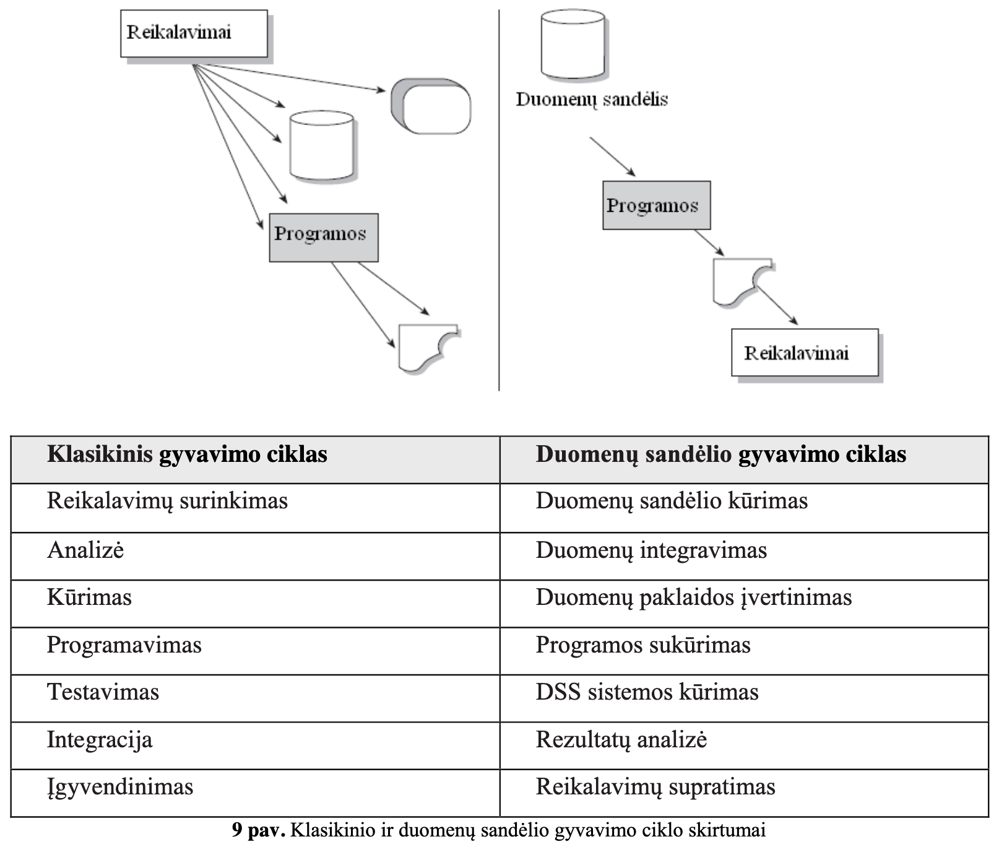
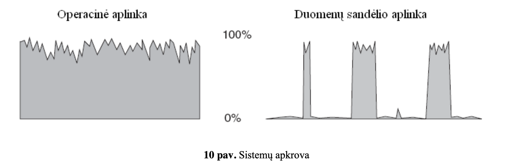
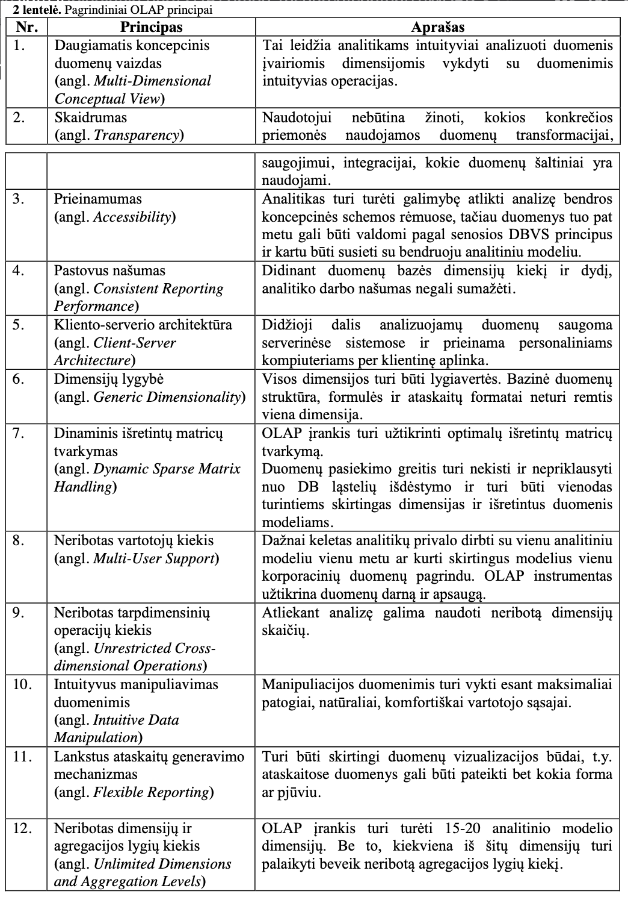
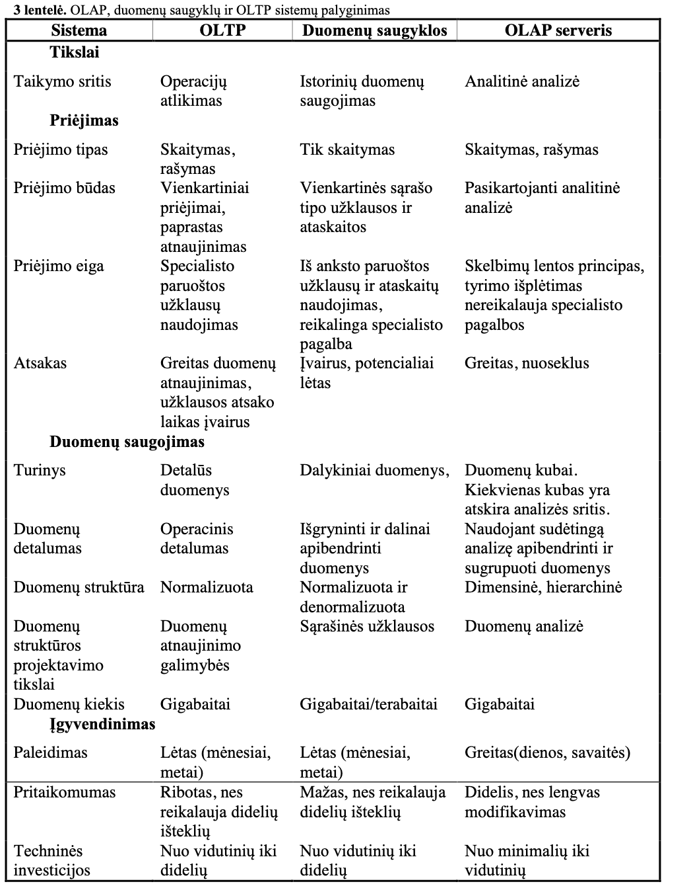
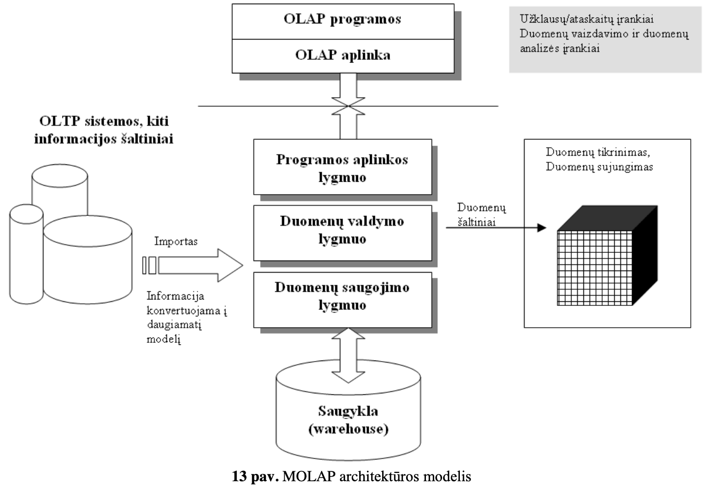
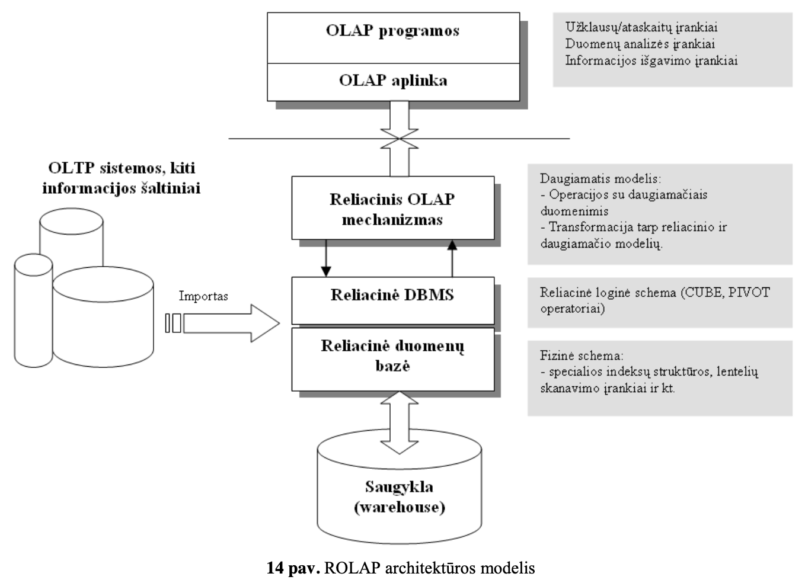
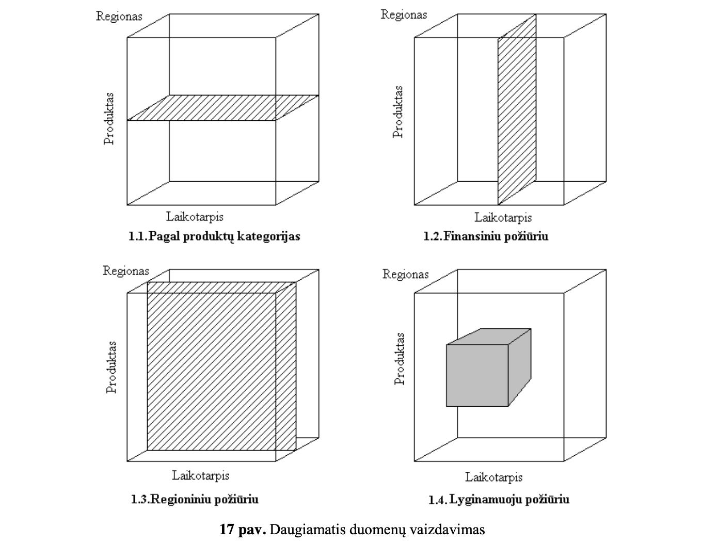
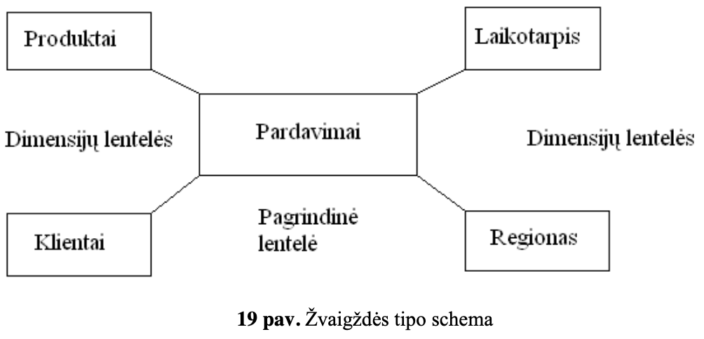
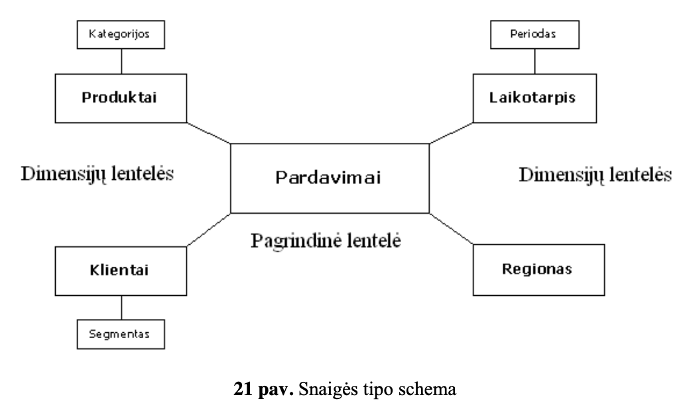

# Modernių duomenų bazių pagrindai

## 3. Duomenų sandėliai, OLAP ir duomenų kubai

### Ivadas

- **IS** – informacinė sistema.
- **DB** – duomenų bazė.
- **DBVS** – duomenų bazės valdymo sistema.
- **SQL** – standartinė užklausų kalba.
- **OLTP** – OnLine Transaction Processing.
- **OLAP** – OnLine Analytical Processing.
- **ETL** – Išgauk/Transformuok/Įkelk (Extract/Transform/Load) procesas.
- **DSS** – Duomenų saugyklos sistema.

### Duomenu sandeliai

- Pagrindinės savaime besivystančios architektūros problemos yra šios:
  - Duomenų patikimumas:
    - ne visada aišku iš kur ir kada atsirado duomenys,
    - skirtingi duomenys yra gaunami naudojant skirtingus algoritmus,
    - duomenų išgavimo iš įvairių duomenų šaltinių proceso skirtumai,
    - išorinių duomenų patikimumo/identifikavimo stoka,
    - nėra bendro pradinio duomenų šaltinio.
  - produktyvumas,
    - kiekvienam duomenu rinkiniui reikia pritaikyti individualia technologija
  - nesugebėjimas transformuoti duomenis į informaciją.
    - duomenų bazėse nebutinai saugomi duomenys, kurių prireiks veliau
- **Pirminiai duomenys** – tai detalūs duomenys, naudojami kasdienėse kompanijos operacijose. Jie gali būti atnaujinami
- **Išvestiniai duomenys** – tai apibendrinti ar kitaip apskaičiuoti duomenys, naudojami vadovybėssprendimų priėmimui. Jie negali būti atnaujinami
- Duomenis galime skaidyti į keturis **lygmenis**:
  - **Operacinis** lygmuo - saugomi tik pagrindiniai duomenys skirti taikomosioms programoms, t.y. transakcijoms atlikti. Taip pat, šiame lygmenyje saugomi išvestiniai duomenys
  - Atominis arba **duomenų sandėlio** lygmuo - Duomenų sandėlyje yra saugomi keletas įrašų, kurie rodo duomenų kitimą. Įrašai duomenų sandėlyje nepersidengia (angl. Overlap).
  - **Departamento** lygmuo(arba duomenų vitrinos lygmuo) - duomenys yra iš esmės skirtingi, kadangi šieduomenys yra denormalizuoti ir pritaikytikiekvienam konkrečiam departamentui
  - **Individualus** lygmuo - Individualiems poreikiams pritaikyti duomenų sandėliai dažniausiai yra laikini ir nedideli.
- **Duomenu integravimas** - kuomet duomenys yra perkeliami iš operacinio lygmens į duomenų sandėlio aplinką
- **DSS analitikas** - visų pirma verslo žmogus, o po to techninis specialistas. Pagrindinis DSS analitiko darbas yra nustatyti ir atskleisti informaciją naudojamą korporacijos sprendimams priimti
- Kuriant sistemas, naudojant **klasikinį** gyvavimo ciklą, reikalavimai yra žinomi kūrimo stadijos **pradžioje** (arba bent gali būti atskleisti),o **DSS analitikas** mano, kad nauji reikalavimai yra **paskutinis** dalykas, kurį reikia išsiaiškinti DSS kūrimo gyvavimo cikle.

- Perejimas is **operacines** aplinkos i **DS** aplinka:
  - Pirmiausia yra atliekamos transformacijos operacinėje aplinkoje.
  - Pašalinama didžioji dalis duomenų (daugiausia archyvinių) iš operacinės aplinkos.
  - Dalis duomenų perkeliama iš operacinės aplinkos į duomenų sandėlio aplinką
- Pagrindinis duomenų sandėlio **palaikymo** uždavinys yra kontroliuoti duomenų sandėlio **spartą**.
- DSS aplinkoje, užklausos atlikimo **greitis** nėra svarbiausias kriterijus. Užklausos DSS duomenų sandėlyje gali būti įvykdytos per minutę, valandą, o kartais net per dieną.

### OLAP

- OnLine **Analytical** Processing - greita daugiamačių duomenų analizė
- OnLine **Transaction** Processing, OLTP
- Pagrindinės OLAP savybės:
  - **Greita** - užklausos rezultatai grąžinami per keletą ar kelias dešimtis sekundžių. Nepriklausomi tyrimai parodė, kad vartotojai priimtina gauti rezultatus ne ilgiau kaip per 30 sekundžių.
  - **Daugiamačiai** duomenys - duomenys pateikiami kaip daugiamatis vaizdas. Duomenų struktūra taip pat gali būti hierarchinė. Tai kol kas geriausias būdas analizuoti verslą ir įmonių struktūrą.
  - **Analizė** - sistema turi būti suderinta su verslo logika ir statistine analize

- **OLAP kubuose** didelė tarpinių skaičiavimų dalis atliekama dar iki duomenų kubo naudojimo, o vieną kartą atliktų tarpinių skaičiavimų rezultatais gali pasinaudoti visi prieigos teises turintys šios duomenų bazės vartotojai.
- OLAP duomenų bazėsfaktai gali būti analizuojami įvairiais pjūviais (dimensijomis).
- Pjūviai gali turėti hierarchinę struktūrą
- Skaičiuojamoji vertė (angl.measure) leidzia atlikti analize pagal skirtingas skaičiuojamąsias reikšmes
- **MOLAP** (angl. multidimensional OLAP) - tai duomenų analizės priemonė, kurioje naudojamas duomenų kubo modelis.
- **ROLAP** veikia reliacinės duomenų bazės pagrindu. Kiekvieną kartą atnaujinant kubo duomenis, kubo reikšmės perskaičiuojamos. ROLAP užklausos nėra tokios greitos kaip MOLAP
- **R**OLAP **privalumai**
  - Duomenys saugomi standartinėje reliacinėje duomenų bazėje,todėl galima panaudoti **standartinius SQL** ataskaitų kūrimo įrankius.
  - ROLAP priemonės leidžia **lanksčiau** valdyti didelius duomenų kiekius.
  - ROLAP įrankiai geriau apdoroja neagreguojamus faktus (angl. non-aggregatable facts), pvz. **tekstinius** duomenis. MOLAP priemonės lėtai vykdo užklausas su tokiais duomenimis.
  - ROLAP priemonės leidžia sudaryti duomenų modelius kurie **netilptų** į griežtą dimensijų modelį.
- **R**OLAP **trūkumai**:
  - ROLAP **lėčiau** veikia esant dideliam duomenų kiekiui.
  - ROLAP naudoja **bendros paskirties** duomenų bazes, kurios neturi specialų MOLAP naudojamų priemonių (pvz. hierarchinio indeksavimo). Tačiau modernios ROLAP priemonės jau turi SQL kalboje numatytus specialius operatorius (CUBE, ROLLUP ir t.t.).
  - ROLAP visiems skaičiavimams naudoja SQL užklausas, todėl ROLAP įrankiai **netinka sudėtingiems** modeliams, kuriuos aprašyti SQL kalba labai sudėtinga.
- **HOLAP** (angl. hybrid OLAP) -tai ROLAP ir MOLAP priemonės apjungtos į vieną.
- Duomenu saugyklos architekturos kurimas:

  1. Duomenų saugyklos idėjos suvokimas,
  2. loginės struktūros sudarymas,
  3. fizinis modeliavimas.

- OLAP sistemos projektavimas:
  1. vartotojo **reikalavimų** analizė,
  2. koncepcinis **modeliavimas**,
  3. loginis ir fizinis **projektavimas**,
  4. **diegimas**,
  5. duomenų saugyklos **panaudojimas**.

#### Kubai

- Daugiamatės duomenų bazės duomenys saugomi **„kubo**“ pavidalu. Suprantama, kubas yra **sudarytas iš lentelių**. Kubas gali būti **n-matis**, o duomenys apibendrinti įvairiais laipsniais.
- Praktikoje dažniausiai duomenų kubai turi 4-12 dimensijas. Deja, šiuolaikinės technologijos dar nėra pakankamai galingos kad dirbtų su labai dideliu dimensijų kiekiu
- Kubo celės reikšmę (angl. **measure**) nusako dimensijų reikšmių **kombinacija**

- Pagrindiniai **dimensijų** realizavimo duomenų modelyje ypatumai:
  - Lentelių ryšiuose tarp tėvų ir vaikų turi būti ryšys **1:n – vienas su daug**. Tai reiškia, kad lentelėje įrašas - tėvas gali turėti vieną ir daugiau susietų įrašų kitoje lentelėje - vaikų, bet vaikas privalo turėti tik vieną tėvą.
  - Tarp hierarchijos **lygmenų** ir jų dimensijų **atributų** ryšio tipas turi būti **1:1**. Pavyzdžiui, jeigu atributo pavadinimas korporacija, tai galimas atributo ryšys tarp lygmenų galėtų būti korporacija – prezidentas.
  - Kiekvienas įrašas vaiko lentelėje turi būti sujungtas su vienu ir tiktai vienu įrašu tėvo lentelėje. Toks ryšys reikalauja, kad lentelės - vaiko sąryšio kodas būtų reikšminis, t.y. ryšio vientisumas turi būti palaikomas nuo vaiko į tėvo jungimo raktą, kuris turi būti unikalus ir negali egzistuoti tėvų neturinčių įrašų vaikų.
  - Hierarchijų lygmenys privalo būti reikšminiai ir turi būti išlaikytas lygmenų vientisumas.
  - Dimensijų hierarchijos **lygmenys** gali **iš dalies persidengti** arba būti **atskirti** vienas nuo kito.
  - Tačiau hierarchijų **stulpeliai** **negali** būti susiję su **daugiau** kaip viena dimensija.
  - Susijungiančios dimensijos, sudarančios ciklus dimensijų grafe, nėra galimos. T.y. bet kuris hierarchijos lygmuo **negali būti sujungtas su pačiu savimi** tiek tiesiogiai tiek netiesiogiai.
- Daugiamatėse duomenų bazėse kontroliuojamas **pertekliškumas** yra **pateisinamas**, jei jis didina informacinę vertę.
- Visus duomenų kubo saugomus duomenis galima suskirstyti į tris pagrindines **kategorijas**:
  - **Pagrindiniai** (angl. core) kubo duomenys - tai duomenys, apibūdinantys duomenų kubo charakteristikas, duomenys apibūdinantys duomenis (angl. meta data)
  - **Standartiniai** duomenų rinkiniai – duomenys naudojami globaliai visame duomenų kube, daugelio dalykų objektų, kitaip dar vadinami – organizacijos duomenų sandėlio modeliu (angl. corporate data warehouse model).
  - Duomenų rinkiniai, susiję su konkrečiu **dalykiniu** objektu (angl. object-oriented data warehouse model, data mart). **būtent ši duomenų kategorija realizuoja daugiamatiškumo sampratą duomenų kubuose.**
- **Schema** vadinamas duomenų bazės objektų -lentelių, rodinių, indeksų ir sinonimų rinkinys.

- **Žvaigždės** tipo schemos sudarymas yra dimensijų lentelių sujungimas su pagrindine lentele naudojant pirminius ir išorinius raktus. Žvaigždės tipo schemoms naudojamas specialus užklausų apdorojimo algoritmas.
- Žvaigždės tipo schemų **privalumai**:
  - Schemos modelis savo struktūra tiesiogiai atspindi vartotojo požiūrį į dalykinį objektą.
  - Schemos modelis efektyviai realizuoja vartotojo galimybes analizuoti dalykinio objekto charakteristikas ir elgseną naudojant pasirinktas dimensijas.
- Žvaigždės tipo schemos **trūkumai**:
  - Pirmas šios schemos trūkumas –naujų atributų prijungimas, t.y mes iškarto turime nuspręsti, kokius atributus naudosime, nes vėliau juos prijungti gali būti sudėtingas ir brangiai kainuojantis uždavinys (pvz.,reikia pridėti suminį rodiklį, tuomet jį reikės užpildyti, o tai reiškia, kadrealiamelaike reikės perskaičiuoti turimus duomenis).
  - Didelis duomenų kiekis (angl. data Explosion) yra antras šios schemos trūkumas.
  - Trečias žvaigždės tipo schemos trūkumas - sudėtingas schemos projektavimas. Pavyzdžiui,apjungus dviar daugiau žvaigždinių schemų į vieną visumą, modelis tampa pakankamai sudėtingas

- Pagrindinis skirtumas tarp žvaigždės ir **snaigės** tipo schemų - snaigės schemos dimensijų struktūra yra labiau normalizuotos nei žvaigždės tipo schemose. Tokiu būdu dimensijų lentelė yra išskaidomi į keletą mažesnių dimensijų lentelių, kuriose suformuojama tam tikra dimensijų hierarchija

---

- **Kubo sudarymo algoritmas**
  1. Duomenų **išrinkimas** iš duomenų saugyklos.
  2. Duomenų **transformacija** į „n“-matį kubą.
  3. Gauto kubo **atvaizdavimas** lentelių ar diagramų pagalba.
- Sukūrus duomenų kubą, OLAP duomenų bazės leis lengvai atlikti įvairius veiksmus:
  - **Agregaciją**-perėjimą nuo bendresnių reikšmių prie individualių ir atvirkščiai, t. y. judėti hierarchinepjūvių (dimensijų) struktūra.
  - Duomenų **apibendrinimą** pagal įvairius parametrus, t. y. analizę įvairiais pjūviais.
  - Kubo **pasukimą** (angl. pivoting rotation).

---

## 1. Didieji duomenys, Hadoop ir Bigdata ekosistemos

- **IS** – informacinė sistema.
- **DB** – duomenų bazė.
- **Big Data** – didieji duomenys.
- **Hadoop** – atvirojo kodo Java platforma skirta saugoti didelėsapimties duomenis.
- **HUE** – Hadoop User Expierence.
- **HDFS** – Hadoop paskirstytųjų failų sistema (angl. Hadoop Distributed File System, HDFS)
- **MapReduce** – lygiagretaus programavimo platforma.
- **SQL** – standartinė užklausų kalba.
- **SQOOP** – SQL to Hadoop & Hadoop to SQL.

### Dideji duomenys

- Pasaulyje kas minutę sukuriama po 1,7 mln. mlrd. baitų, arba 360 000 DVD, duomenų - daugiau kaip 6 megabaitai duomenų kiekvienam žmogui per dieną.
- **Dideliais duomenimis** (angl. Big Data) vadinami tokie duomenų rinkiniai, kuriuos dėl jų dydžio ir sudėtingos struktūros apdoroti paprastomis duomenų apdorojimo programomis ir įrankiais tampa gana sudėtinga ar net neįmanoma:
  - **Apimtis** _(Volume)_ - Viena iš didelių duomenų charakteristikų, nusakančių duomenų dydį.
  - **Greitis** _(Velocity)_ - Ši sąvoka suprantama kaip duomenų atsinaujinimo, didėjimo ir apdorojimo poreikio tenkinimas.
  - **Įvairovė** _(Variety)_ - Charakteristika, nusakanti duomenų tipų įvairumą.
  - **Vertė** _(Value)_ - vertė gauta iš analizuojamų duomenų.
  - **Tikrumas** _(Verification)_ - Ši sąvoka siejama su duomenų bei jų analizės teisingumu bei tikslumu.
  - **Nepastovumas** - Charakteristika, naudojama norint apibūdinti nuolatinį duomenų kitimą ir atsinaujinimą.
  - **Sudėtingumas** - Siejamas su nuolatos augančiais duomenų kiekiais, jų įvairumu bei problemomis, atsirandančiomis analizuojant šiuos duomenis.

### Dideliu duomenu saugojimas

- **Kompiuterių klasteris** – tai į vieną bendrą tinklą sujungti kompiuteriai, kurie geba vykdyti paskirstytus skaičiavimus.
- **Gridas** – tai kaip ir klasteris yra laisvai prieinama, suderinta infrastruktūra, tačiau ją sudaro atskiri skaičiavimo klasteriai.
- **Apache Hadoop** - tai atvirojo kodo programinė įranga, skirta kintamo dydžio didelių duomenų paskirstytiesiems skaičiavimams. Ji susdeda is 3 daliu:
  - Hadoop paskirstytųjų failų sistema (angl. Hadoop Distributed File System, **HDFS**) yra skirta duomenų saugojimui. Sistema sudaryta iš vieno vardo mazgo (angl. NameNode) ir duomenų mazgų (angl. DataNode).:
    - Aukštas klaidų toleravimas – skirtingai nei tradicinėse paskirstytųjų failų sistemose, kurios naudoja duomenų apsaugos mechanizmus, HDFS saugo duomenų kopijas keliuose duomenų mazguose, kas leidžia, aptikus klaidą, atkurtiduomenis iš kitų duomenų mazgų.
    - Didelės apimties duomenų naudojimas – Hadoop klasteriai gali talpinti Petabaitų (PB) dydžio duomenų rinkinius
  - **MapReduce** yra lygiagretaus programavimo platforma leidžianti apdoroti didelės apimties duomenis kompiuterių klasteryje naudojant dvi funkcijas: Map ir Reduce:
    - Platforma gaudama užduotį kreipiasi į vardo mazgą, jis ją suskaido ir paskirsto duomenų mazgams.
    - Tuomet kiekviename duomenų mazge pradedama vykdyti mapfunkcija. Ji duomenims suteikia [raktas/reikšmė] poras. Apdorojus juos, rezultatą taip pat pateikia [raktas/reikšmė] forma.
    - Po šios fazės pradedama vykdyti Reduce funkcija, kuri pašalina perteklinius duomenis ir pateikia galutinį rezultatą.
  - **YARN** - darbo planavimo ir klasteriu istekliu valdymo sistema

---

- **HUE** – (Hadoop User Expierence) sąsaja skirta dirbtisu Hadoop, tiksliau su HDFS duomenimis, kur galima tvarkyti HDFS aplinką, importuoti, dirbti su failais ir t.t.
- **Apache Sqoop** – įrankis, naudojamas perduoti duomenis iš / į HDFS. SQOOP leidžia importuoti / eksportuoti duomenis iš struktūrizuotų duomenų šaltinių, tokių kaip RDBVS bei iš įvairių NoSQL sistemų.

---

- **Big Data lifecycle:**
  - **Duomenų generavimas** - pasaulio stebėjimas
  - **Duomenų filtravimas ir struktūrizavimas** - būtini metodai ištraukti reikalingą informaciją tinkamu formatu analizei ir pašalinti nepatikimus duomenys,kurie gali atsirasti dėl įvairių jutiklių gedimų, šališkų žmonių vertinimų, pasenusios informacijos ir t.t.
  - **Duomenų analizavimas/modeliavimas** - didieji duomenys dažnai yra heterogeniški, dinamiški, tarpusavyje koreliuoti ir nepatikimi.
  - **Rezultatų interpretavimas** - analitikas turi įvertinti gautus rezultatus

---

- _Big Data problems_:
  - **Nenuoseklumas ir neužbaigtumas** - Didieji duomenys generuojami iš vis daugiau skirtingų šaltinių, kurių patikimumas yra įvairus
  - **Duomenų apimtis** - reikia naujų technologijų, metodų duomenims apdoroti, kurie būtų optimalūs kainos ir efektyvumo atžvilgiu, bei susidorotų su sistemos gedimais
  - **Savalaikiškumas** - sistemai veikti efektyviai reikia sukurti naujus indeksavimo metodus
  - **Komanda** - Būtina įsitikinti, kad darbuotojai gali tinkamai suvokti tyrimo eigą ir rezultatus, o nepaskęsti duomenų gausybėje

## 2. RDBVS ir NoSQL

**IS** – informacinė sistema.
**DB** – duomenų bazė.
**DBVS** – duomenų bazės valdymo sistema.
**ER** – esybių ryšių modelis.
**SQL** – standartinė užklausų kalba.
**JavaScript** – į objektą orientuota interpretuojama programavimo kalba.
**JSON** – JavaScript objektų žymėjimas.
**XML–formatas**, skirtas apsikeisti duomenimis.
**BSON** – JSON dokumentas dvejetainiu pavidalu.

### Duomenų valdymas

- **Duomenų valdymas** – priėjimas prie duomenų, jų rašymas, kaupimas, apdorojimas, įvesties ir išvesties operacijų valdymas duomenų apdorojimo sistemoje

### Duomenų valdymo problemos

### Duomenų bazė

- **Duomenų bazė** yra organizuotas (susistemintas, metodiškai sutvarkytas) duomenų rinkinys, kuriuo galima individualiai naudotis elektroniniu ar kitu būdu
- Duomenų bazės vystymosi ciklas:
  - **Planavimas** – reikalavimų nustatymas, pradinis įvertinimas, įvykdymo galimybės.
  - **Analizė** – duomenų srautų analizė, vartotojų reikalavimai.
  - **Projektavimas** – loginės struktūros nustatymas, sistemos projektavimas, specifikacijos aprašymas.
  - **Diegimas** – duomenų bazių įdiegimas, jų testavimas, klaidų aptikimas ir ištaisymas.
  - **Palaikymas** – plėtimas.
- Duomenų bazių naudojimo **privalumai**:
  - Galimybė dalytis integruotais duomenimis
  - Sumažėja duomenų perteklius
  - Padidėja duomenų vientisumas ir tikslumas
  - Paprasčiau ir lengviau naudotis duomenimis
  - Duomenų nepriklausomumas
  - Didesnis duomenų saugumas
  - Trumpesnis atsakymo į užklausą laikas

### Duomenų bazių valdymo sistema

- Duomenų bazių valdymo sistema (**DBVS**) –kompiuterinė programa ar programų paketas, skirtas duomenų bazei valdyti
- Pagrindines funkcijos:
  - duomenų surinkimas ir paruošimas,
  - perdavimas,
  - įvedimas (kodavimas),
  - saugojimas,
  - rūšiavimas, paieška ir operacijos su duomenimis (duomenų analizė),
  - rezultatų pateikimas galutiniam naudotojui.

### DUOMENŲ MODELIAI

- **Duomenų modeliavimas** – tai viso duomenų bazių projektavimo proceso aprašymas.
  - **Loginis projektavimas:**
    - Loginis projektavimas vykstajau po duomenų bazėsmodelio nustatymo
    - Loginis projektavimas – tai scheminio projekto pervedimas į vidinį modelį.
    - Loginį reliacinės DB modelį sudaro lentelių, indeksų, virtualių lentelių, transakcijų projektavimas.
    - Loginio projektavimo metu nustatomos vartotojų ir kitų asmenų teisės naudotis DB.
  - **Fizinis modeliavimas** – tai duomenų saugojimo ir jų priėjimo charakteristikų apibrėžimo procesas, kuris turi įtakosduomenų saugojimo vietaiįrenginyje ir sistemos našumui:
    - Fizinį projektavimą geriau aprašyti kaip techninį darbą.
- **Esybių-ryšių modeliavimas** - abstraktaus konceptualaus duomenų atvaizdavimo žymėjimų modelis. Šis modelis yra įvairių veiklos esybių ir ryšių tarp jų iliustracija.
  - Esybė – tai grindžiama vieno tipo objektų klasė
  - Atributai – tai tam tikri visų objektų požymiai.
    - Žymėjimo standartas, kurio yra laikomasi:
      - Dažniausiai esybės pavadinimas atributo pavadinime nenaudojamas, išskyrus pirminį raktą;
      - Pavadinimas turi atvaizduoti atributo esybę ir parodyti, kaip tai susiję su esybe
      - Atributų pavadinimuose negalima naudoti sutrumpinimų.
  - Ryšys – tai asociacija tarp dviejų esybių:
    - vienas-su-vienu (1:1)
    - vienas-su-daug (1:N)
    - daug-su-daug (N:M).

### Reliacinio modelioduomenų atvaizdavimo specifika

- Reliacinis duomenų modelis yra loginisduomenų modelis:
  - **Struktūrinis aspektas** – duomenys duomenų bazėje yra sąryšių rinkinys;
  - **Darnos aspektas** – sąryšiai tenkina tam tikrus darnos reikalavimus. Darnos reikalavimai taikomi duomenų tipo (domeno), sąryšio ir duomenų bazės lygmenyje;
  - **Manipuliavimo aspektas** – reliacinis duomenų modelis palaiko sąryšių manipuliavimo operatorius (reliacinė algebra, reliaciniai skaičiavimai)
- Pranasumai:
  - modelis gerai suprantamas tiek vartotojams, tiek ir kūrėjams;
  - modelis galibūti transformuotas į kitus duomenų modelius;
  - modelis nėra orientuotas į kompiuterinę terpę;
  - modelis yra kilęs iš duomenų analizės;
  - skirtingi vartotojai gali naudotis modeliu skirtingais požiūriais.
- Koncepcijos:
  - Lentelės koncepcija - lentelė, kurioskiekviena eilutė yra ekvivalentiška įrašui, o kiekvienas stulpelis – laukui
  - Lentelės pirminis raktas - Raktą galima apibrėžti kaip minimalią atributų aibę, vienareikšmiškai apibrėžiančią (kitaip dar sakoma – funkciškai apibrėžiančią) kiekvieno atributo reikšmę eilutėje (įrašą)
  - Ryšiai tarp lentelių - tiesioginiai ryšiai tarp įrašų yra pakeisti susiejimu naudojant pirminius ir išorinius raktus

### NoSQL duomenų valdymo modelis

- **NoSQL** – šiam duomenų valdymo modeliui nebūdingi plačiai naudojamos reliacinės duomenų bazių valdymo sistemos modelio principai

- Pagrindines charakteristikos:
  - Nereikalinga schema
  - Automatinis duomenų suskaidymas –nėra griežtų apribojimų
  - Kaupimas–serveriai
  - Užklausos - turi atskiras užklausų sistemas
  - Integruotas kaupimas –spartinimas
- Tipai:
  - Raktas-reikšmė _(Redis, ...)_
  - Stulpelines saugyklos _(HBase, Cassandra)_
  - Dokumentines saugyklos _(MongoDB, CouchDB)_
  - Diagramines saugyklos - duomenys saugomi lanksčiame grafe _(Neo4J, Bigdata)_

### NoSQL ir RDBMS palyginimas

### NoSQL ir RDBMS principai

