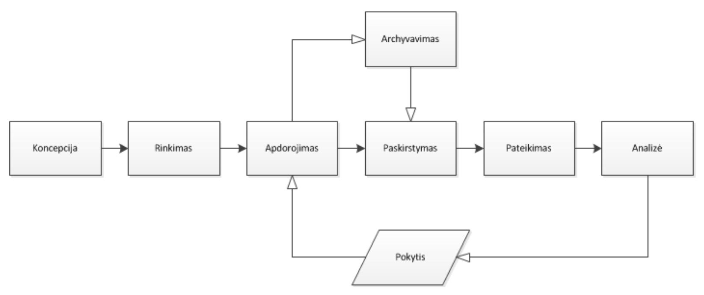
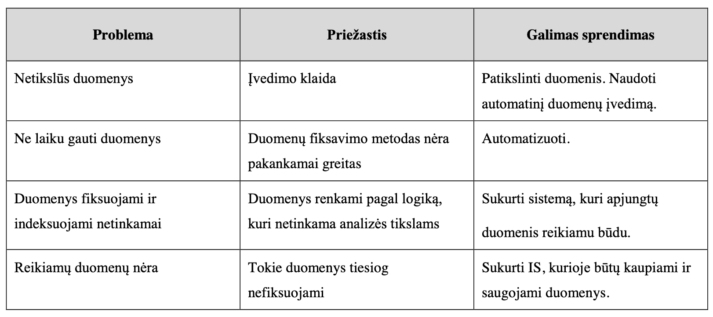
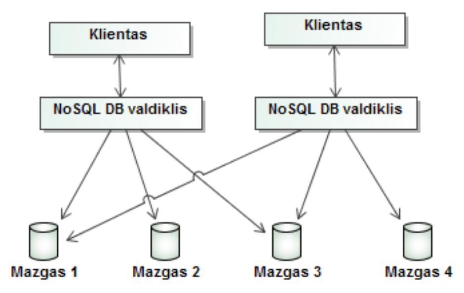
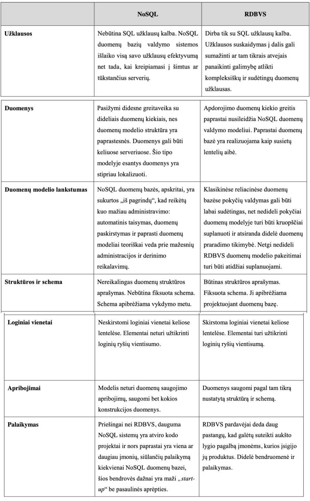
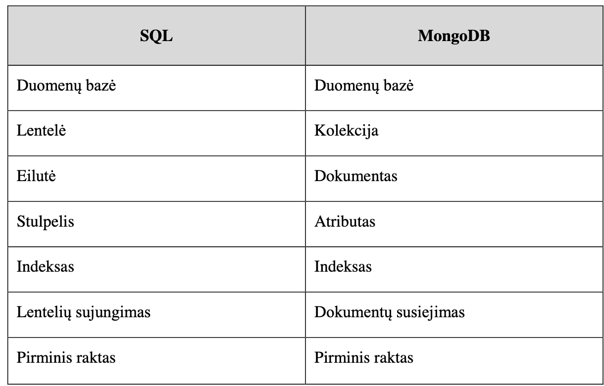

# Modernių duomenų bazių pagrindai

## Didieji duomenys, Hadoop ir Bigdata ekosistemos

- **IS** – informacinė sistema.
- **DB** – duomenų bazė.
- **Big Data** – didieji duomenys.
- **Hadoop** – atvirojo kodo Java platforma skirta saugoti didelėsapimties duomenis.
- **HUE** – Hadoop User Expierence.
- **HDFS** – Hadoop paskirstytųjų failų sistema (angl. Hadoop Distributed File System, HDFS)
- **MapReduce** – lygiagretaus programavimo platforma.
- **SQL** – standartinė užklausų kalba.
- **SQOOP** – SQL to Hadoop & Hadoop to SQL.

### Dideji duomenys

- Pasaulyje kas minutę sukuriama po 1,7 mln. mlrd. baitų, arba 360 000 DVD, duomenų - daugiau kaip 6 megabaitai duomenų kiekvienam žmogui per dieną.
- **Dideliais duomenimis** (angl. Big Data) vadinami tokie duomenų rinkiniai, kuriuos dėl jų dydžio ir sudėtingos struktūros apdoroti paprastomis duomenų apdorojimo programomis ir įrankiais tampa gana sudėtinga ar net neįmanoma:
  - **Apimtis** *(Volume)* - Viena iš didelių duomenų charakteristikų, nusakančių duomenų dydį.
  - **Greitis** *(Velocity)* - Ši  sąvoka  suprantama  kaip  duomenų  atsinaujinimo,  didėjimo  ir  apdorojimo  poreikio tenkinimas.
  - **Įvairovė** *(Variety)* - Charakteristika, nusakanti duomenų tipų įvairumą.
  - **Vertė** *(Value)* - vertė gauta iš analizuojamų duomenų.
  - **Tikrumas** *(Verification)* - Ši sąvoka siejama su duomenų bei jų analizės teisingumu bei tikslumu.
  - **Nepastovumas** - Charakteristika, naudojama norint apibūdinti nuolatinį duomenų kitimą ir atsinaujinimą.
  - **Sudėtingumas** - Siejamas  su  nuolatos  augančiais  duomenų  kiekiais,  jų  įvairumu  bei  problemomis, atsirandančiomis analizuojant šiuos duomenis.

### Dideliu duomenu saugojimas

- **Kompiuterių klasteris** – tai į vieną bendrą tinklą sujungti kompiuteriai, kurie geba vykdyti paskirstytus skaičiavimus.
- **Gridas** – tai kaip ir klasteris yra laisvai prieinama, suderinta infrastruktūra, tačiau ją sudaro atskiri skaičiavimo klasteriai.
- **Apache  Hadoop** - tai  atvirojo  kodo  programinė  įranga,  skirta  kintamo  dydžio  didelių duomenų paskirstytiesiems skaičiavimams. Ji susdeda is 3 daliu:
  - Hadoop paskirstytųjų failų sistema (angl. Hadoop Distributed File System, **HDFS**) yra skirta duomenų saugojimui. Sistema sudaryta iš vieno vardo mazgo (angl. NameNode) ir duomenų mazgų (angl. DataNode).:
    - Aukštas klaidų toleravimas – skirtingai nei tradicinėse paskirstytųjų failų sistemose, kurios  naudoja  duomenų  apsaugos  mechanizmus,  HDFS  saugo  duomenų  kopijas keliuose  duomenų  mazguose,  kas  leidžia,  aptikus  klaidą,  atkurtiduomenis  iš  kitų duomenų mazgų.
    - Didelės apimties duomenų naudojimas – Hadoop klasteriai gali talpinti Petabaitų (PB) dydžio duomenų rinkinius
  - **MapReduce** yra lygiagretaus programavimo platforma leidžianti apdoroti didelės apimties duomenis kompiuterių klasteryje naudojant dvi funkcijas: Map ir Reduce:
    - Platforma gaudama užduotį kreipiasi  į  vardo  mazgą,  jis  ją  suskaido  ir  paskirsto  duomenų  mazgams.
    - Tuomet  kiekviename duomenų mazge pradedama vykdyti mapfunkcija. Ji duomenims suteikia [raktas/reikšmė] poras. Apdorojus juos, rezultatą taip pat pateikia [raktas/reikšmė] forma.
    - Po šios fazės pradedama vykdyti Reduce  funkcija,  kuri  pašalina  perteklinius  duomenis  ir  pateikia  galutinį  rezultatą.
  - **YARN** - darbo planavimo ir klasteriu istekliu valdymo sistema

---

- **HUE** – (Hadoop  User  Expierence) sąsaja  skirta  dirbtisu  Hadoop,  tiksliau  su  HDFS duomenimis, kur galima tvarkyti HDFS aplinką, importuoti, dirbti su failais ir t.t.
- **Apache Sqoop** – įrankis, naudojamas perduoti duomenis iš / į HDFS. SQOOP leidžia importuoti / eksportuoti duomenis iš struktūrizuotų duomenų šaltinių, tokių kaip RDBVS bei iš įvairių NoSQL sistemų.

---

- **Big Data lifecycle:**
  - **Duomenų generavimas** - pasaulio stebėjimas
  - **Duomenų filtravimas ir struktūrizavimas** -  būtini  metodai  ištraukti  reikalingą  informaciją tinkamu formatu analizei ir pašalinti nepatikimus duomenys,kurie gali atsirasti dėl įvairių jutiklių gedimų, šališkų žmonių vertinimų, pasenusios informacijos ir t.t.
  - **Duomenų analizavimas/modeliavimas** - didieji duomenys dažnai yra heterogeniški, dinamiški, tarpusavyje  koreliuoti  ir  nepatikimi.
  - **Rezultatų interpretavimas** - analitikas turi  įvertinti  gautus  rezultatus

---

- *Big Data problems*:
  - **Nenuoseklumas ir neužbaigtumas** - Didieji  duomenys  generuojami iš vis daugiau skirtingų šaltinių, kurių patikimumas yra įvairus
  - **Duomenų apimtis** - reikia naujų  technologijų,  metodų  duomenims  apdoroti,  kurie  būtų  optimalūs  kainos  ir  efektyvumo atžvilgiu, bei susidorotų su sistemos gedimais
  - **Savalaikiškumas** - sistemai veikti efektyviai reikia sukurti naujus indeksavimo metodus
  - **Komanda** - Būtina įsitikinti, kad darbuotojai gali tinkamai suvokti tyrimo eigą ir rezultatus, o nepaskęsti duomenų gausybėje

## RDBVS ir NoSQL

**IS** – informacinė sistema.
**DB** – duomenų bazė.
**DBVS** – duomenų bazės valdymo sistema.
**ER** – esybių ryšių modelis.
**SQL** – standartinė užklausų kalba.
**JavaScript** – į objektą orientuota interpretuojama programavimo kalba.
**JSON** – JavaScript objektų žymėjimas.
**XML–formatas**, skirtas apsikeisti duomenimis.
**BSON** – JSON dokumentas dvejetainiu pavidalu.

### Duomenų valdymas

- **Duomenų valdymas** – priėjimas prie duomenų, jų rašymas, kaupimas, apdorojimas, įvesties ir išvesties operacijų valdymas duomenų apdorojimo sistemoje

### Duomenų valdymo problemos

### Duomenų bazė

- **Duomenų bazė** yra organizuotas (susistemintas, metodiškai sutvarkytas) duomenų rinkinys, kuriuo galima individualiai naudotis elektroniniu ar kitu būdu
- Duomenų bazės vystymosi ciklas:
  - **Planavimas** – reikalavimų nustatymas, pradinis įvertinimas, įvykdymo galimybės.
  - **Analizė** – duomenų srautų analizė, vartotojų reikalavimai.
  - **Projektavimas** – loginės  struktūros  nustatymas, sistemos projektavimas, specifikacijos aprašymas.
  - **Diegimas** – duomenų bazių įdiegimas, jų testavimas, klaidų aptikimas ir ištaisymas.
  - **Palaikymas** – plėtimas.
- Duomenų bazių naudojimo **privalumai**:
  - Galimybė  dalytis  integruotais  duomenimis
  - Sumažėja  duomenų  perteklius
  - Padidėja  duomenų  vientisumas  ir  tikslumas
  - Paprasčiau ir lengviau naudotis duomenimis
  - Duomenų nepriklausomumas
  - Didesnis duomenų saugumas
  - Trumpesnis atsakymo į užklausą laikas

### Duomenų bazių valdymo sistema

- Duomenų bazių valdymo sistema (**DBVS**) –kompiuterinė programa ar programų paketas, skirtas duomenų bazei valdyti
- Pagrindines funkcijos:
  - duomenų surinkimas ir paruošimas,
  - perdavimas,
  - įvedimas (kodavimas),
  - saugojimas,
  - rūšiavimas, paieška ir operacijos su duomenimis (duomenų analizė),
  - rezultatų pateikimas galutiniam naudotojui.

### DUOMENŲ MODELIAI

- **Duomenų modeliavimas** – tai viso duomenų bazių projektavimo proceso aprašymas.
  - **Loginis projektavimas:**
    - Loginis  projektavimas vykstajau  po duomenų  bazėsmodelio  nustatymo
    - Loginis projektavimas – tai scheminio projekto pervedimas į vidinį modelį.
    - Loginį reliacinės DB modelį sudaro lentelių, indeksų, virtualių lentelių, transakcijų projektavimas.
    - Loginio projektavimo metu nustatomos vartotojų ir kitų asmenų teisės naudotis DB.
  - **Fizinis modeliavimas** – tai duomenų saugojimo ir jų priėjimo charakteristikų apibrėžimo procesas,  kuris turi  įtakosduomenų  saugojimo  vietaiįrenginyje  ir  sistemos  našumui:
    - Fizinį projektavimą geriau aprašyti kaip techninį darbą.
- **Esybių-ryšių  modeliavimas** - abstraktaus konceptualaus duomenų atvaizdavimo žymėjimų modelis. Šis modelis yra įvairių veiklos esybių ir ryšių tarp jų iliustracija.
  - Esybė – tai  grindžiama  vieno  tipo  objektų  klasė
  - Atributai – tai tam tikri visų objektų požymiai.
    - Žymėjimo standartas, kurio yra laikomasi:
      - Dažniausiai esybės pavadinimas atributo pavadinime nenaudojamas, išskyrus pirminį raktą;
      - Pavadinimas turi atvaizduoti atributo esybę ir parodyti, kaip tai susiję su esybe
      - Atributų pavadinimuose negalima naudoti sutrumpinimų.
  - Ryšys – tai asociacija tarp dviejų esybių:
    - vienas-su-vienu (1:1)
    - vienas-su-daug (1:N)
    - daug-su-daug (N:M).

### Reliacinio modelioduomenų atvaizdavimo specifika

- Reliacinis duomenų modelis yra loginisduomenų modelis:
  - **Struktūrinis aspektas** – duomenys duomenų bazėje yra sąryšių rinkinys;
  - **Darnos aspektas** – sąryšiai  tenkina  tam  tikrus  darnos  reikalavimus. Darnos reikalavimai taikomi duomenų tipo (domeno), sąryšio ir duomenų bazės lygmenyje;
  - **Manipuliavimo aspektas** – reliacinis  duomenų  modelis  palaiko  sąryšių manipuliavimo operatorius (reliacinė algebra, reliaciniai skaičiavimai)
- Pranasumai:
  - modelis gerai suprantamas tiek vartotojams, tiek ir kūrėjams;
  - modelis galibūti transformuotas į kitus duomenų modelius;
  - modelis nėra orientuotas į kompiuterinę terpę;
  - modelis yra kilęs iš duomenų analizės;
  - skirtingi vartotojai gali naudotis modeliu skirtingais požiūriais.
- Koncepcijos:
  - Lentelės koncepcija - lentelė, kurioskiekviena eilutė yra ekvivalentiška įrašui, o kiekvienas stulpelis – laukui
  - Lentelės pirminis raktas - Raktą galima apibrėžti kaip minimalią atributų aibę, vienareikšmiškai apibrėžiančią (kitaip dar sakoma – funkciškai apibrėžiančią) kiekvieno atributo reikšmę eilutėje (įrašą)
  - Ryšiai tarp lentelių - tiesioginiai ryšiai tarp įrašų yra pakeisti susiejimu naudojant pirminius ir išorinius raktus

### NoSQL duomenų valdymo modelis

- **NoSQL** – šiam duomenų  valdymo  modeliui  nebūdingi plačiai  naudojamos  reliacinės duomenų bazių valdymo  sistemos  modelio  principai

- Pagrindines charakteristikos:
  - Nereikalinga schema
  - Automatinis  duomenų  suskaidymas –nėra  griežtų apribojimų
  - Kaupimas–serveriai
  - Užklausos - turi atskiras užklausų sistemas
  - Integruotas kaupimas –spartinimas
- Tipai:
  - Raktas-reikšmė *(Redis, ...)*
  - Stulpelines saugyklos *(HBase, Cassandra)*
  - Dokumentines saugyklos *(MongoDB, CouchDB)*
  - Diagramines saugyklos - duomenys saugomi lanksčiame grafe *(Neo4J, Bigdata)*

### NoSQL ir RDBMS palyginimas

### NoSQL ir RDBMS principai

  