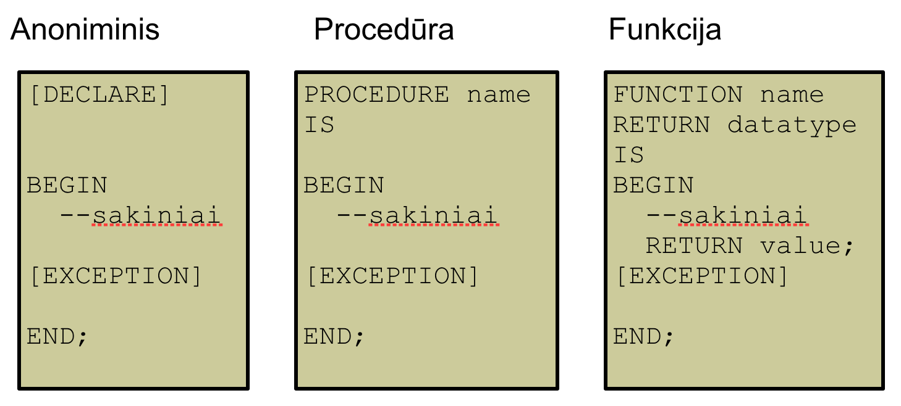

# Programavimas duomenų bazių aplinkoje

## PL/SQL Apžvalga

- PL/SQL (**Procedural Language for SQL**) - Oracle korporacijos sukurtas **Procedūrinis (Procedural Language) SQL išplėtimas**, turintis programinių kalbų ypatybes
- Vykdomojo kodo vienetai yra blokinės struktūros
- **Privalumai:**
  - Integracija: procedūrinių konstrukcijų su SQL
  - Patobulintas vykdymas
  - Modulinės programos kūrimas
  - Integracija su Oracle įrankiais
  - Portatyvumas
  - Programavimas su procedūrinėm kontrolinėm struktūrom
  - Išimčių apdorojimas
- PL/SQL **Bloko struktūra**:
  - `DECLARE` (neprivalomas)
    - kintamieji , kursoriai, vartotojo išimtys
  - `BEGIN` (privalomas)
    - SQL sakiniai
    - PL/SQL sakiniai
  - `EXCEPTION` (neprivalomas)
    - veiksmai kilus išimčiai
  - `END`; (privalomas)
- Bloku tipai:
  - 

## Kintamųjų deklaravimas PL/SQL

- Kintamieji **gali buti naudojam**i:
  - Laikinam duomenų saugojimui
  - Saugomų reikšmių manipuliacijai
  - Pakartotinam naudojimui
- Kintamuju **apribojimai**:
  - Turi prasidėti raide
  - Gali susidėti iš raidžių ir skaičių
  - Galima naudoti simbolius ($, _,  ir #)
  - Maksimalus ilgis 30 simbolių
  - Neturi būti Oracle rezervuoti žodžiai
- `identifier [CONSTANT] datatype [NOT NULL] [:= | DEFAULT expr];`
- Kintamuju **tipai**:
  - PL/SQL kintamieji:
    - Skaliariniai
      - `CHAR` [(maks. ilgis)]
      - `VARCHAR2` (maks. ilgis)
      - `NUMBER` [(tikslumas, mastelis)]
      - `BINARY_INTEGER`
      - `PLS_INTEGER`
      - `BOOLEAN`
      - `BINARY_FLOAT`
      - `BINARY_DOUBLE`
      - `DATE`
      - `TIMESTAMP`
      - `TIMESTAMP WITH TIME ZONE`
      - `TIMESTAMP WITH LOCAL TIME ZONE`
      - `INTERVAL YEAR TO MONTH`
      - `INTERVAL DAY TO SECOND`
    - Sudėtinis
    - Referencinis
    - Large object (LOB)
  - Ne-PL/SQL kintamieji: **Bind kintamieji**
    - Aplinkos kintamieji
    - Kartais vadinami host kintamieji
    - Sukuriamos raktinio žodžio VARIABLE pagalba
    - Naudojami SQL sakiniuose ir PL/SQL blokuose
    - Pasiekiamos po PL/SQL bloko vykdymo
    - Nuoroda į Bind kintamąjį yra (:)
    - `SET AUTOPRINT ON` ijungia automatini spausdinima
- **Geriausios praktikos**:
  - Kodo rašymas naudojant didžiąsias / mažąsias raides pagal Oracle rekomendacijas
  - Inicializuokite kintamuosius aprašytus kaip NOT NULL ir CONSTANT
  - Inicializuokite kintamąsias operatorių (:=) ir DEFAULT pagalba
  - Deklaruokite po vieną vardą arba žymėjimą vienoje eilutėje
  - Kintamasis neturi būti pavadintas tuo pačiu vardu kaip DB lentelės stulpelio vardas
  - Kad būtų aiškiau, kiekvieną kodo lygį reikia atitraukti
    ```sql
    DECLARE
      deptno       NUMBER(4);
      location_id  NUMBER(4);
    ```
- `%TYPE` atributas:
  - Naudojamas deklaruoti kintamąjį pagal duomenų bazės stulpelio arba prieš tai deklaruoto kintamojo tipą
  - `identifier		table.column_name%TYPE;`
  - `identifier		variable_name%TYPE;`

## Vykdomųjų komandų rašymas

- **Zodiniai vienetai** skirstomi i:
  - Vardus (Identifiers): v_fname, c_percent
  - Skirtukus (Delimiters): ; , +, -
  - Žodžius (Literals): John, 428, True
  - Komentarus (Comments): --, /* */
- **SQL funkcijos** PL/SQL-e:
  - **Galimos** procedūriniuose sakiniuose:
    - Vienos eilutės skaitinės funkcijos
    - Vienos eilutės simbolinės funkcijos
    - Duomenų tipo konvertavimo funkcijos
    - Datos funkcijos
    - “Timestamp”
    - GREATEST ir LEAST
    - Kitos funkcijos
  - **Negalimos** procedūriniuose sakiniuose:
    - DECODE
    - Grupavimo funkcijos (AVG,MIN,MAX)
- Kodo komentavimas:
  - Vienos eilutės komentarai `--`.
  - Kelių eilučių komentarai `/*` ir `*/`
- Dazniausiai naudojamos funkcijos:
  - `LENGTH`- `v_desc_size:= LENGTH(v_prod_description);`
- Duomenu tipu konvertavimas:
  - Tiesioginis arba dinaminis (**Implicit** conversion)
  - Netiesioginis (**Explicit** conversion)
    - `TO_CHAR`
    - `TO_DATE`
    - `TO_NUMBER`
    - `TO_TIMESTAMP`
- PL/SQL blokai gali būti **įdėtiniai** bet kurioje vietoje kur galimi vykdomieji sakiniai.
  - Vykdomoje sekcijoje `(BEGIN … END)`
  - Išimčių sekcijoje `(EXCEPTION)`.
- Bloko vardas zymimas `BEGIN <<name>>` ir `END <<name>>`
- PL/SQL operatoriai:
  - Tokie kaip SQL:
    - Loginiai
    - Aritmetiniai
    - Sujungimo
    - Skliaustai operacijų (eiliškumui nurodyti)
  - Laipsnio (**)

## Sąveika su Oracle Duomenų bazė

- SQL Sakiniai PL/SQL-e:
  - Vienos eilutės atrinkimas iš DB naudojant `SELECT ... INTO` komandą.
    - INTO dalis privaloma.
    - Užklausa privalo grąžinti tik vieną eilutę.
  - Duomenų eilučių redagavimas vykdomas `DML` komandomis.
    - `INSERT`
    - `UPDATE`
    - `DELETE`
    - `MERGE`
  - Transakcijų valdymas vykdomas `COMMIT`, `ROLLBACK` ir `SAVEPOINT` komandomis.
- SQL Kursorius
  - **Kursorius** - rodykle į Oracle serverio rezervuotos atminties vieta naudojama SELECT sakinių rezultatams saugoti.
  - Kursorių **tipai**.
    - **Atviras** arba **išorinis Explicit**: Programuotojo deklaruojamas
    - **Uždaras arba vidinis (Implicit)**: Kuriamas ir tvarkomas interaktyviai Oracle serverio SQL sakiniams aptarnauti.
      - Atributai:
      - 
  
## Kontrolinės bloko struktūros

- `IF`
  - Naudojimas:
  ```sql
  IF condition THEN
    statements;
  [ELSIF condition THEN 
    statements;]
  [ELSE 
    statements;]
  END IF;
  ```
- `CASE`
  - CASE išraiška gali gražinti rezultatą arba atlikti veiksmus:
  ```sql
  [var_name :=] CASE selector
    WHEN expression1 THEN result1
    WHEN expression2 THEN result2
    ...
    WHEN expressionN THEN resultN
    [ELSE resultN+1]
  END;
  ```
- Paprastas ciklas:
  - Naudojimas:
  ```sql
  LOOP                      
    statement1;
    . . .
    EXIT [WHEN condition];
  END LOOP;
  ```
- `WHILE`
  - `WHILE` Ciklas naudojimas norint kartoti operatorius kol sąlyga yra `TRUE`.:
  ```sql
  WHILE condition LOOP
    statement1;
    statement2;
    . . .
  END LOOP;
  ```
- `FOR`
  - `FOR` Ciklo atlikimų skaičius bus žinomas prieš pradedant ciklą. Ciklas veikia pagal  iteracinę schemą.
  - Skaitliuko nereikia aprašinėti. Jis bus automatiškai aprašytas cikle kaip LOCAL VARIABLE.
  - Ciklo apatinė ir viršutinė riba privalomos
  - Į skaitliuką negalima kreiptis po ciklo užbaigimo ir priskirti jam vartę ciklo kūne.
  - Ciklo apatinė ir viršutinė riba negali turėti vertę NULL.
  ```sql
  FOR counter IN [REVERSE] 
      lower_bound..upper_bound LOOP  
    statement1;
    statement2;
    . . .
  END LOOP;
  ```
- Ciklu rekomendacijos:
  - `LOOP` naudojamas, kai sakinį, esantį ciklo viduje, reikia vykdyti bent vieną kartą
  - `WHILE LOOP` naudojamas kai sąlyga turi būti perskaičiuojama kiekvienos iteracijos pradžioje
  - `FOR LOOP` naudojamas kai žinomas iteracijų skaičius
- Ciklu zymos
  - Zymima virs ciklo su `<<name>>`
  - Galima iseiti is ciklo su `EXIT name`
  - `CONTINUE` veikimas `CONTINUE [name] [WHEN condition];`
- Darbas su `NULL` reiksmemis:
  - Palyginimo operacijos kai vieną iš verčių NULL grąžina NULL rezultatą.
  - Loginis operatorius NOT su NULL reikšme duoda NULL.
  - Sąlyginiuose kontroliniuose sakiniuose, jei sąlyga grąžina NULL, tai su ja susiję veiksmai neatliekami
